# ĐẠI HỌC PHENIKAA

## TRƯỜNG CÔNG NGHỆ THÔNG TIN

## BÀI TẬP LỚN

**HỌC PHẦN: ĐÁNH GIÁ VÀ KIỂM ĐỊNH CHẤT LƯỢNG PHẦN MỀM**

**DỰ ÁN PHÁT TRIỂN PHẦN MỀM QUẢN LÝ NHA KHOA**

# TÀI LIỆU CÀI ĐẶT

**NHÓM: 07**

<div align="center">

**Nguyễn Nhật Minh - 23010847** (Trưởng nhóm)

**Vũ Viết Tuấn - 23017097**

**Phạm Ngọc Tiến - 23010010**

**Phạm Văn Minh - 23010050**

</div>

**Tháng 6 năm 2026**

## MỤC LỤC

| DANH MỤC HÌNH ẢNH |
| --- |
| CHƯƠNG 1: TỔNG QUAN VỀ HỆ THỐNG QUẢN LÝ PHÒNG KHÁM |
| 1.1. Mô tả bài toán |
| 1.2. Sơ đồ use case tổng quan |
| 1.3. Mô tả ngắn gọn về tác nhân và chức năng |
| CHƯƠNG 2: THIẾT KẾ |
| 2.1. Thiết kế lớp |
| 2.1.1. Program |
| 2.1.2. Models |
| 2.1.3. Repositories |
| 2.1.4. Controllers |
| 2.2. Thiết kế cơ sở dữ liệu |
| CHƯƠNG 3: CÀI ĐẶT |
| 3.1. Kiến trúc và công nghệ sử dụng |
| 3.1.1. Kiến trúc chung của hệ thống |
| 3.1.2. Công nghệ sử dụng |
| 3.2. Cấu trúc mã nguồn |
| 3.2.1. Client |
| 3.2.2. Server |
| 3.2.3. Tests |
| 3.3. Cài đặt một số chức năng |
| 3.3.1. UC2.5. Đăng ký lịch khám của bệnh nhân |
| 3.3.2. UC3.6. Thanh toán chi phí khám bệnh |
| 3.3.3. UC4.4. Lập phiếu lương cho một bác sĩ trong một tháng |
| 3.3.4. UC3.7. Thống kê doanh thu |
| 3.3.5. UC4.5-UC4.7. Báo cáo và xuất Excel lương |

## BẢNG PHÂN CÔNG CÔNG VIỆC

| Thành viên | Lập trình | Kiểm thử | Báo cáo | Mức độ hoàn thành |
| --- | --- | --- | --- | --- |
| Nguyễn Nhật Minh (Trưởng nhóm) | UC1 - Quản lý hệ thống, cấu hình bảo mật, entity/config | Kiểm thử UC1, smoke test | Chương 1 tổng quan, Chương 2 thiết kế lớp, tổng hợp báo cáo | 25% |
| Vũ Viết Tuấn | UC2 - Lịch khám, lịch trực, phòng/ghế, bệnh nhân | Kiểm thử UC2 | Chương 2 thiết kế CSDL, Chương 3 cài đặt UC2.5 | 25% |
| Phạm Ngọc Tiến | UC3 - Tiếp đón, khám bệnh, hóa đơn, thanh toán, doanh thu | Kiểm thử UC3 | Chương 3 cài đặt UC3.6, UC3.7, kiến trúc hệ thống | 25% |
| Phạm Văn Minh | UC4 - Tính lương, báo cáo lương, xuất Excel | Kiểm thử UC4 | Chương 3 cài đặt UC4.4, UC4.5-4.7, cấu trúc mã nguồn | 25% |

## DANH MỤC HÌNH ẢNH

Hình 1-1 Sơ đồ use case tổng quan

Hình 2-1 Sơ đồ lớp chính Program

Hình 2-2 Sơ đồ lớp các Model và DTO

Hình 2-3 Sơ đồ lớp Repository

Hình 2-4 Sơ đồ các lớp Controller

Hình 2-5 Lược đồ cơ sở dữ liệu

Hình 3-1 Mô hình kiến trúc chung của hệ thống

Hình 3-2 Cấu trúc mã nguồn tổng quan

Hình 3-3 Cấu trúc file trong Client

Hình 3-4 Cấu trúc file trong Server

Hình 3-5 Cấu trúc file trong Tests

# CHƯƠNG 1: TỔNG QUAN VỀ HỆ THỐNG QUẢN LÝ PHÒNG KHÁM

## 1.1. Mô tả bài toán

Trong hoạt động của một phòng khám nha khoa, các nghiệp vụ như quản lý nhân sự, quản lý bệnh nhân, đặt lịch khám, tiếp đón, khám bệnh, thanh toán và tính lương bác sĩ cần được xử lý chính xác, có khả năng theo dõi và có dữ liệu thống nhất. Nếu các nghiệp vụ này được thực hiện rời rạc, phòng khám dễ gặp tình trạng trùng lịch bác sĩ, không kiểm soát được hàng đợi khám, thiếu thông tin khi bác sĩ điều trị, sai lệch khi lập hóa đơn hoặc khó tổng hợp doanh thu và tiền lương theo kỳ.

Hệ thống quản lý phòng khám được xây dựng để hỗ trợ phòng khám quản lý tập trung các dữ liệu nghiệp vụ chính. Hệ thống có nhóm chức năng quản lý hệ thống, bao gồm quản lý người dùng, nhân viên, bác sĩ, bệnh nhân, nhóm dịch vụ, dịch vụ và bảng giá dịch vụ. Trong hệ thống, bác sĩ không được tách thành một bảng riêng mà được quản lý như một nhân viên có chức vụ bác sĩ. Người dùng có thể được gắn với nhân viên hoặc bệnh nhân để truy cập các chức năng phù hợp với vai trò được phân quyền.

Bên cạnh đó, hệ thống hỗ trợ quản lý lịch khám thông qua việc thiết lập ngày nghỉ, ca làm việc, phòng khám, ghế nha khoa, lịch trực của bác sĩ và lịch hẹn của bệnh nhân. Khi đặt lịch, hệ thống kiểm tra ngày nghỉ, ca làm việc, lịch trực đã được duyệt, trùng lịch bác sĩ, trùng ghế, trùng lịch bệnh nhân và số lượng lịch hẹn tối đa trong ca.

Nhóm nghiệp vụ tiếp đón và khám bệnh hỗ trợ lễ tân check-in bệnh nhân từ lịch hẹn đã xác nhận, đưa bệnh nhân vào hàng đợi, bác sĩ bắt đầu phiên khám, cập nhật triệu chứng, chẩn đoán, kế hoạch điều trị, ghi chú điều trị, sơ đồ răng và chỉ định dịch vụ. Sau khi phiên khám hoàn tất, hệ thống có thể lập hóa đơn từ các dịch vụ đã chỉ định, ghi nhận giảm giá, thu tiền, hoàn tiền và in hóa đơn.

Cuối cùng, hệ thống hỗ trợ tính lương bác sĩ. Người quản lý có thể thiết lập mức tiền theo giờ, hệ số ca làm việc và hệ số ca phức tạp. Dựa trên các ca trực đã được duyệt, học vị của bác sĩ, hệ số ca và mức tiền theo giờ đang áp dụng, hệ thống lập phiếu lương theo tháng, cho phép tính lại phiếu lương, gửi duyệt, duyệt, hủy và xuất báo cáo lương ra Excel.

## 1.2. Sơ đồ use case tổng quan

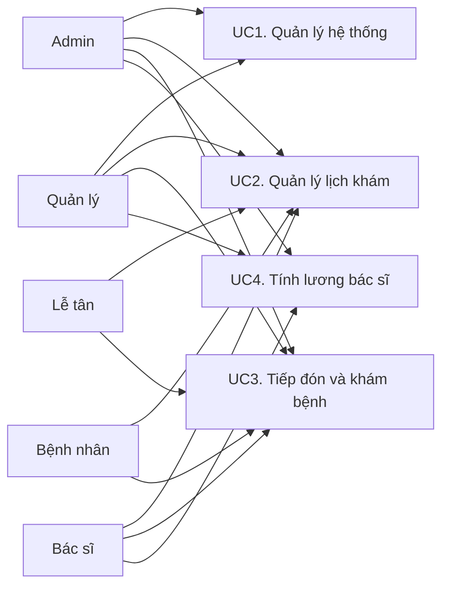

_Hình 1-1 Sơ đồ use case tổng quan_

Sơ đồ use-case trên mô tả các chức năng chính của hệ thống quản lý phòng khám, bao gồm quản lý hệ thống, quản lý lịch khám, tiếp đón và khám bệnh, tính lương bác sĩ. Các tác nhân tham gia gồm Admin, Quản lý, Lễ tân, Bác sĩ và Bệnh nhân.

## 1.3. Mô tả ngắn gọn về tác nhân và chức năng

Hệ thống quản lý phòng khám có các tác nhân và chức năng tương ứng như sau:

- Admin: Người quản trị hệ thống, có quyền quản lý người dùng, nhân viên, dịch vụ, bảng giá, lịch khám, tiếp đón, hóa đơn, doanh thu, thiết lập lương và báo cáo lương.

- Quản lý: Người phụ trách vận hành phòng khám, có quyền quản lý nhân viên, dịch vụ, lịch làm việc, lịch trực, lịch khám, hóa đơn, doanh thu và các nghiệp vụ lương theo phân quyền của hệ thống.

- Lễ tân: Người tiếp nhận bệnh nhân, tạo và theo dõi lịch khám, quản lý thông tin bệnh nhân, check-in bệnh nhân, xem hàng đợi và thực hiện các nghiệp vụ thanh toán được phân quyền.

- Bác sĩ: Người đăng ký lịch trực, xem lịch khám, tiếp nhận bệnh nhân trong hàng đợi, thực hiện khám bệnh, cập nhật hồ sơ điều trị, sơ đồ răng, chỉ định dịch vụ và xem thông tin lương cá nhân.

- Bệnh nhân: Người sử dụng khu vực bệnh nhân để đặt lịch khám, xem lịch hẹn, tra cứu lịch sử điều trị và xem hóa đơn của mình.

# CHƯƠNG 2: THIẾT KẾ

## 2.1. Thiết kế lớp

## 2.1.1. Program

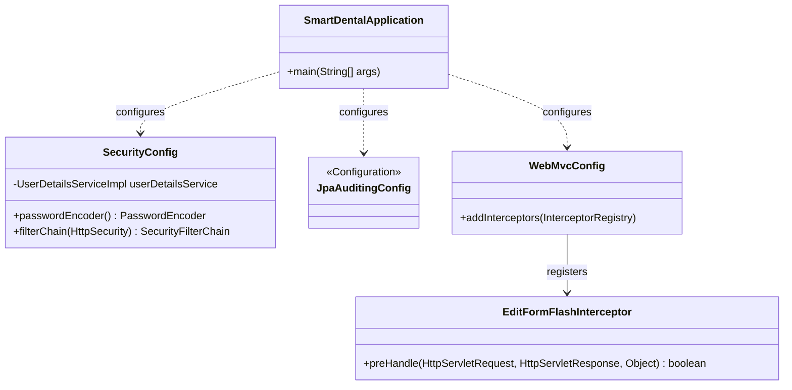

_Hình 2-1 Sơ đồ lớp chính Program_

- SmartDentalApplication: lớp khởi động ứng dụng Spring Boot, chứa hàm main và gọi SpringApplication để chạy hệ thống.

- SecurityConfig: lớp cấu hình bảo mật tổng thể của hệ thống, bao gồm đăng nhập theo form, đăng xuất, mã hóa mật khẩu bằng BCrypt và phân quyền URL theo vai trò.

- JpaAuditingConfig: lớp cấu hình auditing cho các entity, giúp hệ thống tự động quản lý các thông tin thời gian tạo và cập nhật.

- WebMvcConfig: lớp cấu hình MVC, đăng ký interceptor hỗ trợ xử lý dữ liệu form và thông báo trên giao diện.

Các lớp Program và cấu hình này đóng vai trò nền tảng để ứng dụng có thể khởi động, tiếp nhận request từ trình duyệt và áp dụng các quy tắc bảo mật trước khi chuyển request tới controller nghiệp vụ.

## 2.1.2. Models

```mermaid
classDiagram
    direction TB

    class BaseEntity {
        +Long id
        +LocalDateTime createdAt
        +LocalDateTime updatedAt
    }

    class User {
        +String userCode
        +String username
        +String passwordHash
        +String email
        +Role role
        +UserStatus status
    }
    class Employee {
        +String employeeCode
        +String fullName
        +EmployeePosition position
        +DoctorDegree degree
        +EmployeeStatus status
    }
    class Patient {
        +String patientCode
        +String fullName
        +String phone
        +CommonStatus status
    }

    class ServiceCategory {
        +String categoryCode
        +String name
        +CommonStatus status
    }
    class DentalService {
        +String serviceCode
        +String name
        +ServiceUnit unit
        +Integer durationMinutes
    }
    class ServicePrice {
        +BigDecimal price
        +LocalDate effectiveFrom
        +PriceStatus status
    }

    class Holiday {
        +String holidayCode
        +LocalDate startDate
        +LocalDate endDate
        +HolidayType holidayType
    }
    class WorkShift {
        +String shiftCode
        +LocalTime startTime
        +LocalTime endTime
        +WorkShiftDayType dayType
    }
    class Room {
        +String roomCode
        +String name
        +RoomStatus status
    }
    class Chair {
        +String chairCode
        +String name
        +RoomStatus status
    }
    class DoctorShiftRegistration {
        +String registrationCode
        +LocalDate workDate
        +DoctorShiftStatus status
    }
    class Appointment {
        +String appointmentCode
        +LocalDate appointmentDate
        +AppointmentStatus status
        +AppointmentSource source
    }

    class VisitCheckin {
        +LocalDateTime checkinTime
        +Integer queueNumber
        +CheckinStatus status
    }
    class TreatmentSession {
        +String sessionCode
        +String diagnosis
        +TreatmentSessionStatus status
    }
    class MedicalRecord {
        +String recordCode
    }
    class RegisteredService {
        +BigDecimal unitPrice
        +Integer quantity
        +BigDecimal totalAmount
    }
    class Invoice {
        +String invoiceCode
        +BigDecimal totalAmount
        +BigDecimal finalAmount
        +InvoiceStatus status
    }
    class Payment {
        +BigDecimal amount
        +PaymentMethod paymentMethod
        +PaymentType paymentType
    }

    class PayrollSlip {
        +String slipCode
        +Integer payrollYear
        +Integer payrollMonth
        +BigDecimal totalSalary
        +PayrollStatus status
    }
    class PayrollItem {
        +BigDecimal totalHours
        +BigDecimal convertedHours
        +BigDecimal amount
    }
    class DoctorHourlyRate {
        +BigDecimal hourlyRate
        +LocalDate effectiveFrom
        +HourlyRateStatus status
    }
    class ShiftCoefficient {
        +BigDecimal coefficient
        +LocalDate effectiveFrom
    }
    class ComplexCaseCoefficient {
        +BigDecimal coefficient
        +ApprovalStatus status
    }

    BaseEntity <|-- User
    BaseEntity <|-- Employee
    BaseEntity <|-- Patient
    BaseEntity <|-- DentalService
    BaseEntity <|-- ServiceCategory
    BaseEntity <|-- ServicePrice
    BaseEntity <|-- Appointment
    BaseEntity <|-- TreatmentSession
    BaseEntity <|-- Invoice
    BaseEntity <|-- Payment
    BaseEntity <|-- PayrollSlip
    BaseEntity <|-- PayrollItem

    User --> Employee : employee
    User --> Patient : patient
    DentalService --> ServiceCategory : category
    ServicePrice --> DentalService : dentalService
    Chair --> Room : room
    DoctorShiftRegistration --> Employee : doctor
    DoctorShiftRegistration --> WorkShift : workShift
    Appointment --> Patient : patient
    Appointment --> Employee : doctor
    Appointment --> WorkShift : workShift
    Appointment --> DoctorShiftRegistration : doctorShiftRegistration
    VisitCheckin --> Appointment : appointment
    TreatmentSession --> Appointment : appointment
    TreatmentSession --> MedicalRecord : medicalRecord
    TreatmentSession --> Patient : patient
    TreatmentSession --> Employee : doctor
    RegisteredService --> TreatmentSession : treatmentSession
    RegisteredService --> DentalService : dentalService
    RegisteredService --> ServicePrice : servicePrice
    Invoice --> TreatmentSession : treatmentSession
    Invoice --> Patient : patient
    Payment --> Invoice : invoice
    PayrollSlip --> Employee : doctor
    PayrollItem --> PayrollSlip : payrollSlip
    PayrollItem --> DoctorShiftRegistration : doctorShiftRegistration
    ShiftCoefficient --> WorkShift : workShift
    ComplexCaseCoefficient --> TreatmentSession : treatmentSession
    ComplexCaseCoefficient --> Employee : doctor
    MedicalRecord --> Patient : patient
```

_Hình 2-2 Sơ đồ lớp các Model và DTO_

- Nhóm entity người dùng và nhân sự gồm User, Employee và Patient. User lưu thông tin tài khoản đăng nhập và vai trò; Employee lưu thông tin nhân viên, trong đó bác sĩ là nhân viên có chức vụ bác sĩ; Patient lưu hồ sơ bệnh nhân.

- Nhóm entity dịch vụ gồm ServiceCategory, DentalService và ServicePrice. Các lớp này mô tả nhóm dịch vụ, dịch vụ nha khoa và bảng giá dịch vụ theo ngày hiệu lực.

- Nhóm entity lịch khám gồm Holiday, WorkShift, Room, Chair, DoctorShiftRegistration, Appointment và AppointmentStatusLog. Đây là các lớp chính phục vụ việc thiết lập lịch làm việc, lịch trực và lịch hẹn.

- Nhóm entity khám bệnh và thanh toán gồm VisitCheckin, TreatmentSession, MedicalRecord, DentalToothStatus, ToothTreatmentHistory, RegisteredService, Invoice và Payment. Các lớp này quản lý quy trình từ tiếp đón đến khám, chỉ định dịch vụ, lập hóa đơn và ghi nhận thanh toán.

- Nhóm entity lương gồm DoctorHourlyRate, ShiftCoefficient, ComplexCaseCoefficient, PayrollSlip và PayrollItem. Các lớp này dùng để thiết lập mức lương, hệ số và lập phiếu lương bác sĩ.

- Nhóm form/DTO gồm các lớp như UserForm, EmployeeForm, AppointmentForm, CheckinForm, ExaminationForm, RegisteredServiceForm, InvoiceDiscountForm, PaymentForm, RefundForm, PayrollSlipCreateForm, HourlyRateForm, ShiftCoefficientForm và ComplexCaseCoefficientForm. Các lớp form này nhận dữ liệu người dùng nhập trên giao diện Thymeleaf và chuyển cho service xử lý.

- Nhóm enum gồm Role, UserStatus, EmployeePosition, AppointmentStatus, DoctorShiftStatus, CheckinStatus, TreatmentSessionStatus, RegisteredServiceStatus, InvoiceStatus, PaymentStatus, PayrollStatus, ApprovalStatus, DiscountType, PaymentMethod và các enum nghiệp vụ khác. Enum giúp hệ thống biểu diễn vai trò, trạng thái và loại dữ liệu nghiệp vụ một cách thống nhất.

## 2.1.3. Repositories

```mermaid
classDiagram
    class JpaRepository {
        <<interface>>
    }

    class UserRepository {
        +findByUsername(String) Optional~User~
        +findByEmail(String) Optional~User~
        +searchByKeyword(String) List~User~
    }
    class EmployeeRepository {
        +findByPhone(String) Optional~Employee~
        +searchByKeyword(String) List~Employee~
    }
    class PatientRepository {
        +findByPhone(String) Optional~Patient~
        +searchByKeyword(String) List~Patient~
    }
    class AppointmentRepository {
        +existsDoctorConflict(...) boolean
        +existsChairConflict(...) boolean
        +existsPatientConflictOnShift(...) boolean
    }
    class DoctorShiftRegistrationRepository {
        +findConfirmedByDoctorDateAndShift(...) Optional
    }
    class VisitCheckinRepository {
        +findByAppointmentAndActiveStatus(...) Optional
    }
    class TreatmentSessionRepository {
        +findByAppointmentId(Long) Optional
    }
    class RegisteredServiceRepository {
        +findByTreatmentSessionId(Long) List
    }
    class InvoiceRepository {
        +findByTreatmentSessionId(Long) Optional
    }
    class PaymentRepository {
        +findByPaidAtBetween(...) List~Payment~
    }
    class PayrollSlipRepository {
        +findByDoctorIdAndPayrollYearAndPayrollMonth(...) Optional
    }
    class PayrollItemRepository {
        +findByPayrollSlipId(Long) List
    }

    JpaRepository <|.. UserRepository
    JpaRepository <|.. EmployeeRepository
    JpaRepository <|.. PatientRepository
    JpaRepository <|.. AppointmentRepository
    JpaRepository <|.. DoctorShiftRegistrationRepository
    JpaRepository <|.. VisitCheckinRepository
    JpaRepository <|.. TreatmentSessionRepository
    JpaRepository <|.. RegisteredServiceRepository
    JpaRepository <|.. InvoiceRepository
    JpaRepository <|.. PaymentRepository
    JpaRepository <|.. PayrollSlipRepository
    JpaRepository <|.. PayrollItemRepository
```

_Hình 2-3 Sơ đồ lớp Repository_

Repository trong hệ thống là các interface kế thừa Spring Data JPA Repository. Các repository có nhiệm vụ thao tác với cơ sở dữ liệu, bao gồm tìm kiếm dữ liệu theo từ khóa, kiểm tra trùng dữ liệu, tìm theo trạng thái, tìm theo khoảng ngày và lấy dữ liệu phục vụ báo cáo.

Một số repository tiêu biểu gồm UserRepository, EmployeeRepository, PatientRepository, AppointmentRepository, DoctorShiftRegistrationRepository, VisitCheckinRepository, TreatmentSessionRepository, RegisteredServiceRepository, InvoiceRepository, PaymentRepository, PayrollSlipRepository và PayrollItemRepository. Trong đó, AppointmentRepository hỗ trợ kiểm tra trùng lịch bác sĩ, trùng ghế và lịch hẹn của bệnh nhân; PaymentRepository cung cấp dữ liệu cho báo cáo doanh thu; PayrollSlipRepository cung cấp dữ liệu cho báo cáo lương.

## 2.1.4. Controllers

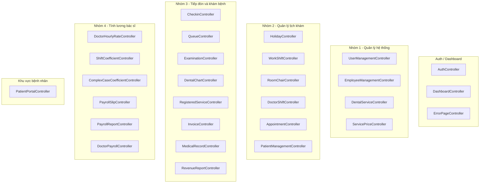

_Hình 2-4 Sơ đồ các lớp Controller_

Các controller là lớp tiếp nhận request từ trình duyệt, bind dữ liệu form, gọi service để xử lý nghiệp vụ, sau đó trả về trang Thymeleaf hoặc redirect kèm thông báo thành công, thông báo lỗi.

Nhóm controller quản lý hệ thống gồm UserManagementController, EmployeeManagementController, DentalServiceController và ServicePriceController. Nhóm controller lịch khám gồm HolidayController, WorkShiftController, RoomChairController, DoctorShiftController, AppointmentController và PatientManagementController. Nhóm controller tiếp đón và khám bệnh gồm CheckinController, QueueController, ExaminationController, DentalChartController, RegisteredServiceController, InvoiceController và RevenueReportController. Nhóm controller lương gồm DoctorHourlyRateController, ShiftCoefficientController, ComplexCaseCoefficientController, PayrollSlipController, PayrollReportController và DoctorPayrollController.

Ngoài ra, PatientPortalController cung cấp các màn hình dành cho bệnh nhân như đặt lịch, xem lịch hẹn, xem lịch sử điều trị và hóa đơn. AuthController xử lý đăng nhập, còn DashboardController hiển thị trang tổng quan sau khi người dùng đăng nhập thành công.

## 2.2. Thiết kế cơ sở dữ liệu

_Hình 2-5 Lược đồ cơ sở dữ liệu_

```mermaid
erDiagram
    users ||--o| employees : "employee_id"
    users ||--o| patients : "patient_id"

    employees ||--o{ doctor_shift_registrations : "doctor_id"
    employees ||--o{ appointments : "doctor_id"
    employees ||--o{ treatment_sessions : "doctor_id"
    employees ||--o{ payroll_slips : "doctor_id"
    employees ||--o{ complex_case_coefficients : "doctor_id"
    employees ||--o{ doctor_hourly_rates : "doctor_id (nullable)"

    patients ||--o{ appointments : "patient_id"
    patients ||--o{ treatment_sessions : "patient_id"
    patients ||--o{ invoices : "patient_id"
    patients ||--o{ medical_records : "patient_id"
    patients ||--o{ dental_tooth_status : "patient_id"

    service_categories ||--o{ services : "category_id"
    services ||--o{ service_prices : "service_id"
    services ||--o{ registered_services : "service_id"

    rooms ||--o{ chairs : "room_id"
    rooms ||--o{ doctor_shift_registrations : "room_id"
    rooms ||--o{ appointments : "room_id"

    chairs ||--o{ doctor_shift_registrations : "chair_id"
    chairs ||--o{ appointments : "chair_id"

    work_shifts ||--o{ doctor_shift_registrations : "work_shift_id"
    work_shifts ||--o{ appointments : "work_shift_id"
    work_shifts ||--o{ shift_coefficients : "work_shift_id"

    doctor_shift_registrations ||--o{ appointments : "doctor_shift_registration_id"
    doctor_shift_registrations ||--o{ payroll_items : "doctor_shift_registration_id"

    appointments ||--o{ appointment_status_logs : "appointment_id"
    appointments ||--o| visit_checkins : "appointment_id"
    appointments ||--o| treatment_sessions : "appointment_id"

    treatment_sessions ||--o{ registered_services : "treatment_session_id"
    treatment_sessions ||--o| invoices : "treatment_session_id"
    treatment_sessions ||--o| medical_records : "treatment_session_id"
    treatment_sessions ||--o{ complex_case_coefficients : "treatment_session_id"

    registered_services }o--|| service_prices : "service_price_id"

    invoices ||--o{ payments : "invoice_id"

    payroll_slips ||--o{ payroll_items : "payroll_slip_id"

    dental_tooth_status ||--o{ tooth_treatment_histories : "tooth_status_id"

    users {
        bigint id PK
        varchar user_code UK
        varchar username UK
        varchar email
        enum role
        enum status
    }
    employees {
        bigint id PK
        varchar employee_code UK
        varchar full_name
        enum position
        enum degree
        enum status
    }
    patients {
        bigint id PK
        varchar patient_code UK
        varchar full_name
        varchar phone UK
        enum status
    }
    service_categories {
        bigint id PK
        varchar category_code UK
        varchar name
        enum status
    }
    services {
        bigint id PK
        varchar service_code UK
        varchar name
        enum unit
        bigint category_id FK
    }
    service_prices {
        bigint id PK
        decimal price
        date effective_from
        enum status
        bigint service_id FK
    }
    holidays {
        bigint id PK
        varchar holiday_code UK
        date start_date
        date end_date
        enum holiday_type
    }
    work_shifts {
        bigint id PK
        varchar shift_code UK
        time start_time
        time end_time
        enum day_type
        int max_appointments
    }
    rooms {
        bigint id PK
        varchar room_code UK
        varchar name
        enum status
    }
    chairs {
        bigint id PK
        varchar chair_code UK
        varchar name
        bigint room_id FK
        enum status
    }
    doctor_shift_registrations {
        bigint id PK
        varchar registration_code UK
        date work_date
        enum status
        bigint doctor_id FK
        bigint work_shift_id FK
        bigint room_id FK
        bigint chair_id FK
    }
    appointments {
        bigint id PK
        varchar appointment_code UK
        date appointment_date
        time start_time
        time end_time
        enum status
        enum source
        bigint patient_id FK
        bigint doctor_id FK
        bigint work_shift_id FK
    }
    visit_checkins {
        bigint id PK
        datetime checkin_time
        int queue_number
        enum status
        bigint appointment_id FK
    }
    treatment_sessions {
        bigint id PK
        varchar session_code UK
        text diagnosis
        enum status
        bigint appointment_id FK
        bigint patient_id FK
        bigint doctor_id FK
    }
    medical_records {
        bigint id PK
        varchar record_code UK
        bigint patient_id FK
        bigint treatment_session_id FK
    }
    registered_services {
        bigint id PK
        decimal unit_price
        int quantity
        decimal total_amount
        enum status
        bigint treatment_session_id FK
        bigint service_id FK
        bigint service_price_id FK
    }
    invoices {
        bigint id PK
        varchar invoice_code UK
        decimal total_amount
        decimal discount_amount
        decimal final_amount
        decimal paid_amount
        decimal remaining_amount
        enum status
        bigint treatment_session_id FK
        bigint patient_id FK
    }
    payments {
        bigint id PK
        decimal amount
        enum payment_method
        enum payment_type
        enum status
        datetime paid_at
        bigint invoice_id FK
    }
    payroll_slips {
        bigint id PK
        varchar slip_code UK
        int payroll_year
        int payroll_month
        decimal total_salary
        enum status
        bigint doctor_id FK
    }
    payroll_items {
        bigint id PK
        decimal total_hours
        decimal converted_hours
        decimal amount
        bigint payroll_slip_id FK
        bigint doctor_shift_registration_id FK
    }
    doctor_hourly_rates {
        bigint id PK
        decimal hourly_rate
        date effective_from
        enum status
    }
    shift_coefficients {
        bigint id PK
        decimal coefficient
        date effective_from
        bigint work_shift_id FK
    }
    complex_case_coefficients {
        bigint id PK
        decimal coefficient
        enum status
        bigint treatment_session_id FK
        bigint doctor_id FK
    }
    dental_tooth_status {
        bigint id PK
        int tooth_number
        enum tooth_status
        bigint patient_id FK
    }
    tooth_treatment_histories {
        bigint id PK
        bigint tooth_status_id FK
        bigint treatment_session_id FK
    }
    appointment_status_logs {
        bigint id PK
        enum old_status
        enum new_status
        bigint appointment_id FK
    }
    code_sequences {
        bigint id PK
        varchar prefix UK
        bigint current_value
    }
    audit_logs {
        bigint id PK
        varchar action
        varchar entity_type
    }
```


Cơ sở dữ liệu của hệ thống được quản lý bằng Flyway migration và lưu trên MySQL. Các bảng được chia theo các nhóm nghiệp vụ chính:

- Nhóm người dùng và nhân sự gồm users, employees, patients, audit_logs và code_sequences. Bảng users liên kết với employees hoặc patients tùy theo loại tài khoản. Bảng employees lưu cả nhân viên và bác sĩ; bác sĩ được xác định thông qua chức vụ bác sĩ.

- Nhóm dịch vụ và bảng giá gồm service_categories, services và service_prices. Dịch vụ thuộc một nhóm dịch vụ, bảng giá gắn với dịch vụ và có ngày hiệu lực để phục vụ việc lấy giá khi chỉ định dịch vụ.

- Nhóm lịch khám gồm holidays, work_shifts, rooms, chairs, doctor_shift_registrations, appointments và appointment_status_logs. Lịch khám có thể gắn với bác sĩ, bệnh nhân, ca làm việc, phòng, ghế và lịch trực của bác sĩ.

- Nhóm khám bệnh và thanh toán gồm visit_checkins, medical_records, treatment_sessions, dental_tooth_status, tooth_treatment_histories, registered_services, invoices và payments. Phiên khám liên kết với bệnh nhân, bác sĩ và lịch hẹn; dịch vụ chỉ định được dùng để lập hóa đơn; các khoản thu và hoàn tiền được lưu trong payments.

- Nhóm lương gồm doctor_hourly_rates, shift_coefficients, complex_case_coefficients, payroll_slips và payroll_items. Phiếu lương gắn với bác sĩ, tháng, năm; các dòng lương lưu số giờ, hệ số ca, hệ số phức tạp, hệ số học vị, mức tiền theo giờ và số tiền tính được.

Nhìn chung, thiết kế cơ sở dữ liệu đi theo hướng quản lý tập trung các đối tượng nghiệp vụ chính của phòng khám. Các bảng có quan hệ khóa ngoại để bảo đảm dữ liệu lịch khám, phiên khám, hóa đơn, thanh toán và phiếu lương luôn truy vết được về bệnh nhân, bác sĩ hoặc dịch vụ liên quan.

# CHƯƠNG 3: CÀI ĐẶT

## 3.1. Kiến trúc và công nghệ sử dụng

## 3.1.1. Kiến trúc chung của hệ thống

_Hình 3-1 Mô hình kiến trúc chung của hệ thống_

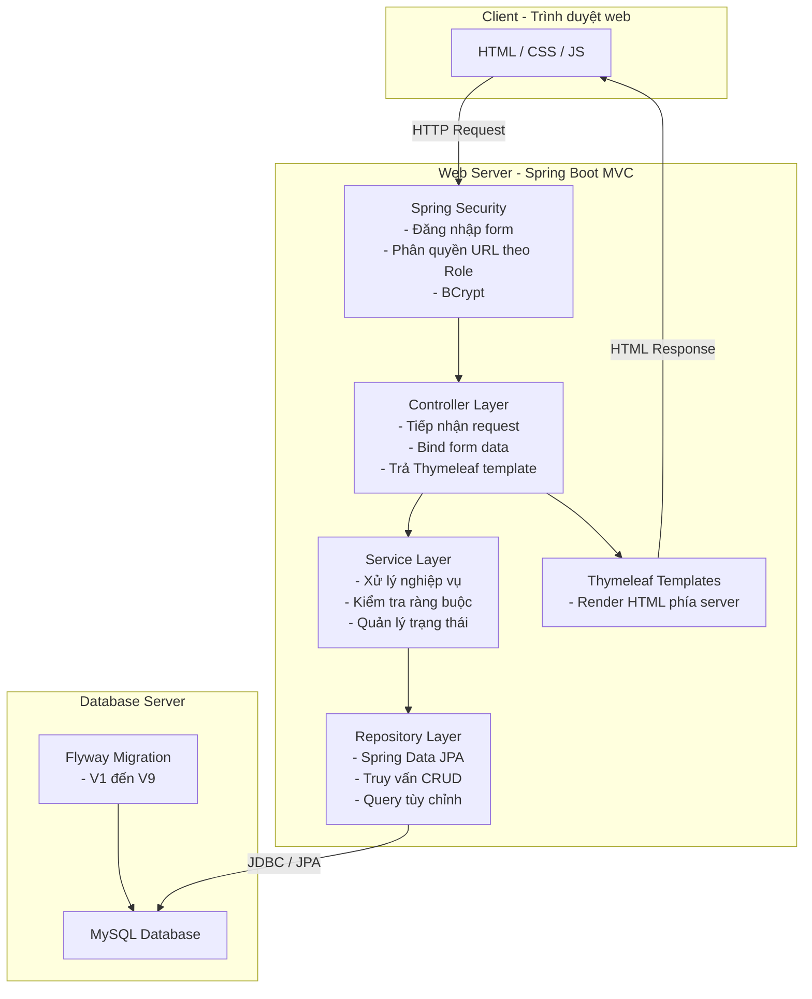


## Vai trò của từng thành phần:

- Client:

   - Là trình duyệt web người dùng sử dụng để truy cập vào hệ thống.

   - Giao diện người dùng được render bằng Thymeleaf phía server, kết hợp HTML, CSS và JavaScript tĩnh.

   - Người dùng thao tác trên các màn hình quản lý hệ thống, lịch khám, tiếp đón, khám bệnh, hóa đơn, doanh thu, lương và khu vực bệnh nhân.

- Web Server:

   - Là ứng dụng Spring Boot chạy theo mô hình MVC.

   - Controller tiếp nhận request từ client, chuyển dữ liệu form sang service.

   - Service xử lý nghiệp vụ, kiểm tra ràng buộc, cập nhật trạng thái và gọi repository.

   - Repository sử dụng Spring Data JPA để thao tác với cơ sở dữ liệu.

   - Sau khi xử lý, controller trả về template Thymeleaf hoặc redirect kèm thông báo.

- Database Server:

   - Lưu trữ toàn bộ dữ liệu chính của hệ thống, bao gồm người dùng, nhân viên, bệnh nhân, lịch khám, khám bệnh, hóa đơn, thanh toán và lương.

   - Hệ quản trị cơ sở dữ liệu chính là MySQL.

   - Cấu trúc schema được tạo và cập nhật bằng Flyway migration.

- Security:

   - Spring Security xử lý đăng nhập, đăng xuất và phân quyền theo vai trò.

   - Mật khẩu được mã hóa bằng BCrypt.

   - Các URL nghiệp vụ được phân quyền cho Admin, Quản lý, Lễ tân, Bác sĩ và Bệnh nhân.

## 3.1.2. Công nghệ sử dụng

## 3.1.2.1. Java 17

Java 17 là ngôn ngữ lập trình chính của hệ thống. Đây là phiên bản LTS, ổn định và phù hợp cho các ứng dụng web doanh nghiệp. Trong hệ thống phòng khám, Java được sử dụng để xây dựng controller, service, repository, entity, form, enum và các lớp tiện ích.

Ưu điểm nổi bật của Java 17 là khả năng kiểm soát kiểu dữ liệu chặt chẽ, hệ sinh thái thư viện lớn và khả năng tích hợp tốt với Spring Boot. Điều này giúp mã nguồn hệ thống dễ tổ chức theo lớp, dễ bảo trì và thuận tiện cho kiểm thử tự động.

## 3.1.2.2. Spring Boot

Spring Boot là framework chính dùng để khởi tạo và vận hành ứng dụng web. Hệ thống sử dụng Spring Boot 3.2.5 để cấu hình ứng dụng, quản lý dependency, tự động cấu hình các thành phần web, bảo mật, JPA và test.

Trong hệ thống, SmartDentalApplication là lớp khởi động. Khi ứng dụng chạy, Spring Boot tự động quét các bean như controller, service, repository, configuration và đưa chúng vào container để phục vụ xử lý request.

## 3.1.2.3. Spring MVC và Thymeleaf

Spring MVC được sử dụng để tổ chức luồng xử lý theo mô hình Model - View - Controller. Controller nhận request từ trình duyệt, đọc tham số hoặc form, gọi service xử lý và đưa dữ liệu vào Model.

Thymeleaf được sử dụng để render HTML phía server. Các template trong thư mục resources/templates hiển thị bảng danh sách, form nhập liệu, bộ lọc, trạng thái, thông báo và các nút thao tác nghiệp vụ. Cách triển khai này phù hợp với hệ thống quản lý nội bộ vì giao diện được sinh ra trực tiếp từ dữ liệu server.

## 3.1.2.4. Spring Security

Spring Security được sử dụng để bảo vệ hệ thống. SecurityConfig cấu hình trang đăng nhập, đăng xuất, trang lỗi 403, mã hóa mật khẩu bằng BCrypt và phân quyền URL theo vai trò.

Các nhóm chức năng được phân quyền theo vai trò. Ví dụ, quản lý người dùng chỉ dành cho Admin; lịch khám dành cho Admin, Quản lý, Lễ tân và Bác sĩ tùy màn hình; khu vực bệnh nhân chỉ dành cho tài khoản có vai trò Bệnh nhân.

## 3.1.2.5. Spring Data JPA

Spring Data JPA được sử dụng để ánh xạ các entity Java với bảng dữ liệu MySQL. Các repository kế thừa JpaRepository giúp giảm đáng kể mã truy vấn CRUD thông thường, đồng thời vẫn cho phép viết query tùy chỉnh khi cần kiểm tra trùng lịch, lấy báo cáo hoặc tìm kiếm theo điều kiện.

Trong hệ thống, các entity như Appointment, TreatmentSession, Invoice, Payment và PayrollSlip được quản lý thông qua repository tương ứng. Service gọi repository để đọc và ghi dữ liệu trong các transaction.

## 3.1.2.6. MySQL

MySQL là hệ quản trị cơ sở dữ liệu chính của hệ thống. Cấu hình datasource sử dụng JDBC URL trỏ tới database Clinic, driver com.mysql.cj.jdbc.Driver và JPA validate schema khi khởi động.

MySQL lưu trữ dữ liệu lâu dài của phòng khám, bao gồm thông tin người dùng, bệnh nhân, lịch hẹn, phiên khám, hóa đơn, thanh toán và bảng lương. Các quan hệ khóa ngoại giúp dữ liệu nghiệp vụ có thể truy vết qua nhiều bước xử lý.

## 3.1.2.7. Flyway

Flyway được sử dụng để quản lý migration cơ sở dữ liệu. Các file SQL trong thư mục resources/db/migration tạo schema theo từng nhóm chức năng: lõi hệ thống, quản lý hệ thống, lịch khám, khám bệnh - thanh toán và lương.

Nhờ Flyway, cấu trúc cơ sở dữ liệu được quản lý theo phiên bản. Khi triển khai hoặc nâng cấp hệ thống, các migration được chạy theo thứ tự để bảo đảm schema phù hợp với mã nguồn hiện tại.

## 3.1.2.8. Apache POI

Apache POI được sử dụng để tạo file Excel cho báo cáo lương. Lớp PayrollExcelExportService tạo workbook, sheet, dòng tiêu đề, dòng dữ liệu và chuyển workbook thành mảng byte để controller trả về cho người dùng tải xuống.

Công nghệ này được áp dụng cho báo cáo lương tháng, báo cáo lương năm của một bác sĩ và báo cáo lương năm của toàn bộ bác sĩ.

## 3.1.2.9. JUnit, MockMvc và H2

JUnit và Spring Boot Test được sử dụng để viết kiểm thử tự động. MockMvc hỗ trợ kiểm thử controller và luồng request trong môi trường test mà không cần khởi chạy server thật. H2 được sử dụng làm cơ sở dữ liệu trong môi trường test, giúp kiểm thử chạy độc lập với MySQL.

Trong mã nguồn hiện có các test hồi quy theo từng phase, smoke test, test render màn hình chi tiết và các service test cho khám bệnh, hóa đơn và hệ số ca phức tạp.

## 3.2. Cấu trúc mã nguồn

_Hình 3-2 Cấu trúc mã nguồn tổng quan_

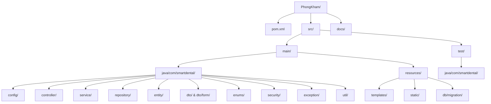

Dự án được tổ chức theo cấu trúc chuẩn của Spring Boot:

- pom.xml: file cấu hình Maven, khai báo phiên bản Spring Boot, Java và các dependency.

- src/main/java: chứa mã nguồn server, bao gồm controller, service, repository, entity, form, enum, config, security và utility.

- src/main/resources/templates: chứa giao diện Thymeleaf.

- src/main/resources/static: chứa CSS, JavaScript và tài nguyên tĩnh.

- src/main/resources/db/migration: chứa các file Flyway migration.

- src/test/java: chứa mã nguồn kiểm thử tự động.

## 3.2.1. Client

_Hình 3-3 Cấu trúc file trong Client_

```mermaid
flowchart TB
    TMPL["resources/templates/"]
    TMPL --> LAYOUT["layout/ - layout chung, header, sidebar"]
    TMPL --> AUTH["auth/ - màn hình đăng nhập"]
    TMPL --> DASH["dashboard/ - trang tổng quan"]
    TMPL --> SYS["system/ - người dùng, nhân viên, dịch vụ, bảng giá"]
    TMPL --> SCHED["schedule/ - ngày nghỉ, ca, phòng/ghế, lịch trực, lịch khám, bệnh nhân"]
    TMPL --> CLIN["clinical/ - check-in, hàng đợi, khám, sơ đồ răng, dịch vụ, hóa đơn, doanh thu"]
    TMPL --> PAY["payroll/ - tiền giờ, hệ số ca, hệ số phức tạp, phiếu lương, báo cáo"]
    TMPL --> PAT["patient/ - đặt lịch, lịch hẹn, lịch sử điều trị, hóa đơn bệnh nhân"]
    TMPL --> ERR["error/ - trang lỗi 403, 404, 500"]

    STAT["resources/static/"]
    STAT --> CSS["css/ - style.css, invoice-print.css"]
    STAT --> JS["js/ - modal.js, calendar.js, tương tác UI"]
```

Phần client của hệ thống nằm trong resources/templates và resources/static:

- templates/layout: chứa layout dùng chung, header, sidebar, fragment giao diện.

- templates/auth: chứa màn hình đăng nhập.

- templates/dashboard: chứa trang tổng quan sau khi đăng nhập.

- templates/system: chứa giao diện quản lý người dùng, nhân viên, dịch vụ và bảng giá.

- templates/schedule: chứa giao diện quản lý ngày nghỉ, ca làm việc, phòng/ghế khám, lịch trực, lịch khám và bệnh nhân.

- templates/clinical: chứa giao diện check-in, hàng đợi, khám bệnh, hồ sơ, sơ đồ răng, chỉ định dịch vụ, hóa đơn, in hóa đơn và doanh thu.

- templates/payroll: chứa giao diện thiết lập lương, hệ số ca, hệ số ca phức tạp, phiếu lương và báo cáo lương.

- templates/patient: chứa giao diện bệnh nhân đặt lịch, xem lịch hẹn, xem lịch sử điều trị và hóa đơn.

- static/css: chứa stylesheet chung và stylesheet phục vụ in hóa đơn.

- static/js: chứa JavaScript hỗ trợ modal, lịch và các tương tác giao diện.

## 3.2.2. Server

_Hình 3-4 Cấu trúc file trong Server_

```mermaid
flowchart TB
    PKG["com.smartdental"]
    PKG --> SmartDental["SmartDentalApplication.java"]
    PKG --> CFG["config/ - SecurityConfig, JpaAuditingConfig, WebMvcConfig, EditFormFlashInterceptor"]
    PKG --> CTRL["controller/ - 26 controller classes"]
    PKG --> SVC["service/ - AppointmentService, InvoiceService, PayrollService..."]
    PKG --> REPO["repository/ - 22 JPA repository interfaces"]
    PKG --> ENT["entity/ - 29 entity classes + BaseEntity"]
    PKG --> DTOP["dto/ - RevenueDTO, PayrollDTO..."]
    PKG --> FORM["dto/form/ - 28 form classes"]
    PKG --> ENUM["enums/ - Role, UserStatus, AppointmentStatus..."]
    PKG --> SECU["security/ - CustomUserDetails, UserDetailsServiceImpl"]
    PKG --> EXC["exception/ - BusinessException, GlobalExceptionHandler"]
    PKG --> UTL["util/ - GridLayoutUtil"]

    MIG["resources/db/migration/"]
    MIG --> V1["V1 - Core tables"]
    MIG --> V2["V2 - System management"]
    MIG --> V3["V3 - Schedule"]
    MIG --> V4["V4 - Clinical"]
    MIG --> V5["V5 - Payroll"]
    MIG --> V6["V6-V9 - Enhancements"]
```

Phần server nằm trong package com.smartdental:

- config: chứa cấu hình bảo mật, JPA auditing, MVC và interceptor.

- controller: chứa các lớp controller tiếp nhận request từ giao diện.

- service: chứa xử lý nghiệp vụ chính của hệ thống.

- repository: chứa interface truy cập dữ liệu bằng Spring Data JPA.

- entity: chứa các entity ánh xạ bảng dữ liệu.

- dto và dto/form: chứa các lớp dữ liệu trả về hoặc nhận dữ liệu từ form.

- enums: chứa enum vai trò, trạng thái và loại nghiệp vụ.

- security: chứa CustomUserDetails và UserDetailsServiceImpl phục vụ xác thực.

- util: chứa các lớp tiện ích, ví dụ tiện ích xử lý bố cục lịch.

- exception: chứa BusinessException và GlobalExceptionHandler để chuẩn hóa lỗi nghiệp vụ.

- resources/db/migration: chứa các migration SQL tạo bảng, ràng buộc và dữ liệu mẫu.

## 3.2.3. Tests

_Hình 3-5 Cấu trúc file trong Tests_

```mermaid
flowchart TB
    TEST["src/test/java/com/smartdental/"]
    TEST --> SMOKE["SmokeTest - khởi động, login, dashboard"]
    TEST --> P1["Phase1RegressionTest - UC1"]
    TEST --> P2["Phase2RegressionTest - UC2"]
    TEST --> P3["Phase3RegressionTest - UC3"]
    TEST --> P4["Phase4RegressionTest - UC4"]
    TEST --> P5["Phase5HardeningTest - tích hợp"]
    TEST --> P6["Phase6FullUseCaseCoverageTest - bổ sung luồng"]
    TEST --> DPR["DetailPageRenderTest - render chi tiết"]
    TEST --> EXS["ExaminationServiceTest - service khám bệnh"]
    TEST --> INV["InvoiceServiceTest - service hóa đơn"]
    TEST --> CCC["ComplexCaseCoefficientServiceTest - hệ số phức tạp"]
    TEST --> GLU["GridLayoutUtilTest - bố cục lịch"]
```

Thư mục src/test/java chứa các kiểm thử tự động của hệ thống. Các test chính gồm SmokeTest để kiểm tra ứng dụng khởi động, các PhaseRegressionTest để kiểm thử hồi quy theo từng nhóm chức năng, Phase6FullUseCaseCoverageTest để kiểm tra bổ sung các luồng use case trọng điểm, DetailPageRenderTest để kiểm tra render một số màn hình chi tiết, GridLayoutUtilTest để kiểm tra tiện ích bố cục lịch và các service test như ExaminationServiceTest, InvoiceServiceTest, ComplexCaseCoefficientServiceTest.

Các test sử dụng Spring Boot Test, MockMvc, Spring Security Test và H2. Nhờ đó, hệ thống có thể kiểm tra các luồng nghiệp vụ chính trong môi trường độc lập với cơ sở dữ liệu MySQL thật.

## 3.3. Cài đặt một số chức năng

## 3.3.1. UC2.5. Đăng ký lịch khám của bệnh nhân

- Đoạn mã quan trọng:

```java
@Transactional
public Appointment create(AppointmentForm form, AppointmentSource source) {
    validateDateAndShift(form);

    Patient patient = resolvePatient(form);
    Employee doctor = resolveDoctor(form.getDoctorId());
    WorkShift workShift = resolveWorkShift(form.getWorkShiftId());

    if (holidayRepository.existsActiveHolidayOnDate(form.getAppointmentDate())) {
        throw new BusinessException("Ngày được chọn là ngày nghỉ của phòng khám.");
    }
    if (workShift.getDayType() != null
            && !workShift.getDayType().appliesTo(form.getAppointmentDate())) {
        throw new BusinessException("Ca khám này không áp dụng cho ngày khám đã chọn.");
    }

    LocalTime startTime = resolveArrivalTime(form, workShift);
    LocalTime endTime = workShift.getEndTime();

    DoctorShiftRegistration registration = doctorShiftRegistrationRepository
            .findConfirmedByDoctorDateAndShift(
                    doctor.getId(), form.getAppointmentDate(), workShift.getId())
            .orElseThrow(() -> new BusinessException(
                    "Bác sĩ chưa có lịch trực được duyệt cho ngày và ca khám đã chọn."));

    if (appointmentRepository.existsDoctorConflict(
            doctor.getId(), form.getAppointmentDate(), startTime, endTime, null)) {
        throw new BusinessException("Bác sĩ đã có lịch khám trùng khung giờ này.");
    }
    if (appointmentRepository.existsChairConflict(
            registration.getChair().getId(), form.getAppointmentDate(), startTime, endTime, null)) {
        throw new BusinessException("Ghế nha khoa đã được sử dụng trong khung giờ này.");
    }
    if (appointmentRepository.existsPatientConflictOnShift(
            patient.getId(), form.getAppointmentDate(), workShift.getId(), null)) {
        throw new BusinessException("Bệnh nhân đã có lịch khám trong ca này.");
    }

    Appointment appointment = new Appointment();
    appointment.setAppointmentCode(codeGeneratorService.nextCode(CodePrefix.APPOINTMENT));
    appointment.setPatient(patient);
    appointment.setDoctor(doctor);
    appointment.setWorkShift(workShift);
    appointment.setDoctorShiftRegistration(registration);
    appointment.setRoom(registration.getRoom());
    appointment.setChair(registration.getChair());
    appointment.setAppointmentDate(form.getAppointmentDate());
    appointment.setStartTime(startTime);
    appointment.setEndTime(endTime);
    appointment.setSource(source);
    appointment.setStatus(AppointmentStatus.PENDING);
    return appointmentRepository.save(appointment);
}
```

- Giải thích:

Chức năng đặt lịch khám được xử lý trong AppointmentService. Khi người dùng gửi form đặt lịch, hệ thống kiểm tra ngày khám, ca khám, bệnh nhân, bác sĩ và dịch vụ nếu có. Nếu bệnh nhân chưa tồn tại, hệ thống có thể tạo hồ sơ bệnh nhân mới từ thông tin trên form.

Sau đó, hệ thống kiểm tra ngày được chọn có phải ngày nghỉ của phòng khám hay không. Ca làm việc cũng phải phù hợp với ngày khám. Giờ đến khám phải nằm trong khoảng thời gian của ca làm việc.

Khi chọn bác sĩ, hệ thống yêu cầu bác sĩ phải có lịch trực đã được duyệt cho đúng ngày và ca. Lịch trực này cũng là nguồn để gán phòng và ghế nha khoa cho lịch hẹn. Hệ thống tiếp tục kiểm tra trùng lịch bác sĩ, trùng ghế và trùng lịch bệnh nhân trong cùng ca.

Nếu tất cả điều kiện hợp lệ, hệ thống sinh mã lịch hẹn, tạo Appointment ở trạng thái PENDING, lưu vào cơ sở dữ liệu và ghi log trạng thái. Luồng này giúp hạn chế các lỗi thường gặp như đặt lịch vào ngày nghỉ, đặt ngoài ca làm việc hoặc đặt trùng lịch khám.

## 3.3.2. UC3.6. Thanh toán chi phí khám bệnh

- Đoạn mã quan trọng:

```java
private Invoice buildAndSaveInvoice(TreatmentSession session,
                                    List<RegisteredService> services) {
    BigDecimal total = services.stream()
            .map(RegisteredService::getTotalAmount)
            .reduce(BigDecimal.ZERO, BigDecimal::add);

    Invoice invoice = new Invoice();
    invoice.setInvoiceCode(codeGeneratorService.nextCode(CodePrefix.INVOICE));
    invoice.setPatient(session.getPatient());
    invoice.setTreatmentSession(session);
    invoice.setTotalAmount(total);
    invoice.setDiscountType(DiscountType.NONE);
    invoice.setDiscountAmount(BigDecimal.ZERO);
    invoice.setFinalAmount(total);
    invoice.setPaidAmount(BigDecimal.ZERO);
    invoice.setRemainingAmount(total);
    invoice.setStatus(InvoiceStatus.UNPAID);
    invoiceRepository.save(invoice);

    for (RegisteredService service : services) {
        service.setStatus(RegisteredServiceStatus.INVOICED);
        registeredServiceRepository.save(service);
    }
    return invoice;
}

@Transactional
public Payment collect(PaymentForm form) {
    Invoice invoice = invoiceRepository.findById(form.getInvoiceId())
            .orElseThrow(() -> new BusinessException("Không tìm thấy hóa đơn."));

    BigDecimal amount = form.getAmount();
    if (amount == null || amount.compareTo(BigDecimal.ZERO) <= 0) {
        throw new BusinessException("Số tiền thu phải lớn hơn 0.");
    }
    if (amount.compareTo(invoice.getRemainingAmount()) > 0) {
        throw new BusinessException("Số tiền thu không được lớn hơn số tiền còn lại.");
    }

    Payment payment = new Payment();
    payment.setInvoice(invoice);
    payment.setAmount(amount);
    payment.setPaymentMethod(PaymentMethod.valueOf(form.getPaymentMethod()));
    payment.setPaymentType(PaymentType.PAYMENT);
    payment.setStatus(PaymentStatus.SUCCESS);
    paymentRepository.save(payment);

    invoice.setPaidAmount(invoice.getPaidAmount().add(amount));
    invoice.setRemainingAmount(invoice.getFinalAmount().subtract(invoice.getPaidAmount()));
    invoice.setStatus(invoice.getRemainingAmount().compareTo(BigDecimal.ZERO) <= 0
            ? InvoiceStatus.PAID : InvoiceStatus.PARTIAL);
    invoiceRepository.save(invoice);
    return payment;
}
```

- Giải thích:

Trước khi lập hóa đơn, RegisteredServiceManagementService cho phép bác sĩ hoặc admin cập nhật dịch vụ chỉ định khi dịch vụ còn ở trạng thái ACTIVE và phiên khám còn OPEN. Các thông tin có thể cập nhật gồm số lượng, giảm giá, số răng và ghi chú. Hệ thống tính lại totalAmount theo công thức đơn giá đã ghi nhận nhân số lượng mới trừ số tiền giảm giá; dịch vụ đã INVOICED hoặc CANCELLED không được cập nhật.

Hóa đơn được tạo từ các dịch vụ đã được chỉ định trong phiên khám. Hệ thống cộng tổng tiền của các RegisteredService đang đủ điều kiện lập hóa đơn, sau đó tạo Invoice với tổng tiền ban đầu, giảm giá bằng 0, số tiền đã thu bằng 0, số tiền còn lại bằng tổng tiền và trạng thái UNPAID.

Khi áp dụng giảm giá, InvoiceService kiểm tra hóa đơn chưa thanh toán đủ và chưa có khoản thu nào. Hệ thống hỗ trợ các loại giảm giá NONE, AMOUNT và PERCENT. Nếu giảm theo phần trăm, số tiền giảm được tính từ tổng tiền hóa đơn và làm tròn hai chữ số thập phân.

Khi thu tiền, PaymentService kiểm tra số tiền thu phải lớn hơn 0 và không vượt quá số tiền còn lại của hóa đơn. Sau khi lưu Payment ở loại PAYMENT, hệ thống cập nhật paidAmount, remainingAmount và trạng thái hóa đơn. Nếu không còn số tiền phải thu, hóa đơn chuyển sang PAID; nếu còn, hóa đơn ở trạng thái PARTIAL.

Khi hoàn tiền, hệ thống tạo Payment loại REFUND, trừ lại paidAmount, tính lại remainingAmount và cập nhật trạng thái hóa đơn về UNPAID hoặc PARTIAL tùy theo số tiền còn lại đã thu. Màn hình in hóa đơn sử dụng dữ liệu hóa đơn, dịch vụ và lịch sử thanh toán để hiển thị bản in.

## 3.3.3. UC4.4. Lập phiếu lương cho một bác sĩ trong một tháng

- Đoạn mã quan trọng:

```java
@Transactional
public PayrollSlip create(PayrollSlipCreateForm form) {
    Employee doctor = employeeRepository.findById(form.getDoctorId())
            .orElseThrow(() -> new BusinessException("Không tìm thấy bác sĩ."));
    if (doctor.getPosition() != EmployeePosition.DOCTOR) {
        throw new BusinessException("Chỉ có thể lập phiếu lương cho bác sĩ.");
    }
    if (payrollSlipRepository.findByDoctorIdAndPayrollYearAndPayrollMonth(
            doctor.getId(), form.getPayrollYear(), form.getPayrollMonth()).isPresent()) {
        throw new BusinessException("Bác sĩ đã có phiếu lương cho tháng này.");
    }

    YearMonth period = YearMonth.of(form.getPayrollYear(), form.getPayrollMonth());
    if (payrollCalculationService.hasPendingComplexCoefficient(doctor.getId(), period)) {
        throw new BusinessException("Còn hệ số ca phức tạp đang chờ duyệt trong tháng này.");
    }

    List<PayrollItem> items = payrollCalculationService.calculateItems(doctor, period);

    PayrollSlip slip = new PayrollSlip();
    slip.setSlipCode(codeGeneratorService.nextCode(CodePrefix.PAYROLL_SLIP));
    slip.setDoctor(doctor);
    slip.setPayrollYear(form.getPayrollYear());
    slip.setPayrollMonth(form.getPayrollMonth());
    slip.setStatus(PayrollStatus.DRAFT);
    slip.setTotalSalary(sumAmounts(items));
    payrollSlipRepository.save(slip);

    for (PayrollItem item : items) {
        item.setPayrollSlip(slip);
        payrollItemRepository.save(item);
    }
    return slip;
}

private PayrollItem calculateItem(DoctorShiftRegistration registration,
                                  BigDecimal hourlyRate,
                                  BigDecimal degreeCoefficient) {
    BigDecimal totalHours = computeTotalHours(registration);
    BigDecimal shiftCoefficient = shiftCoefficientService
            .getCoefficientForShiftOnDate(
                    registration.getWorkShift().getId(), registration.getWorkDate());
    BigDecimal patientCoefficient = computePatientCoefficient(registration);

    BigDecimal convertedHours = totalHours.multiply(shiftCoefficient.add(patientCoefficient))
            .setScale(2, RoundingMode.HALF_UP);
    BigDecimal amount = convertedHours.multiply(degreeCoefficient).multiply(hourlyRate)
            .setScale(2, RoundingMode.HALF_UP);

    PayrollItem item = new PayrollItem();
    item.setTotalHours(totalHours);
    item.setShiftCoefficientSnapshot(shiftCoefficient);
    item.setPatientCoefficientSnapshot(patientCoefficient);
    item.setConvertedHours(convertedHours);
    item.setDegreeCoefficientSnapshot(degreeCoefficient);
    item.setHourlyRateSnapshot(hourlyRate);
    item.setAmount(amount);
    return item;
}
```

- Giải thích:

Phiếu lương được lập cho một bác sĩ trong một tháng cụ thể. Trước khi lập phiếu, hệ thống kiểm tra người được chọn phải là bác sĩ, tháng/năm phải hợp lệ và bác sĩ chưa có phiếu lương cho tháng đó. Hệ thống cũng kiểm tra trong tháng còn hệ số ca phức tạp đang chờ duyệt hay không; nếu còn, người dùng phải xử lý trước khi lập phiếu lương.

PayrollCalculationService lấy các ca trực đã được duyệt của bác sĩ trong tháng. Với mỗi ca trực, hệ thống tính tổng giờ làm việc dựa trên thời gian bắt đầu và kết thúc của ca, lấy hệ số ca theo ngày làm việc, cộng thêm hệ số ca phức tạp đã được duyệt từ các phiên khám liên quan.

Công thức cài đặt trong hệ thống là: số giờ quy đổi bằng tổng giờ nhân với tổng của hệ số ca và hệ số ca phức tạp; tiền lương của dòng bằng số giờ quy đổi nhân hệ số học vị và mức tiền theo giờ. Các giá trị số giờ quy đổi và số tiền được làm tròn hai chữ số thập phân theo RoundingMode.HALF_UP.

Sau khi tính xong danh sách dòng lương, hệ thống tạo PayrollSlip ở trạng thái DRAFT, lưu tổng lương và lưu các PayrollItem tương ứng. Phiếu lương có thể được tính lại khi còn ở trạng thái DRAFT, gửi duyệt sang PENDING, duyệt sang APPROVED hoặc hủy khi chưa được duyệt.

## 3.3.4. UC3.7. Thống kê doanh thu

- Đoạn mã quan trọng:

```java
@Transactional(readOnly = true)
public RevenueSummary summarize(LocalDate fromDate,
                                LocalDate toDate,
                                PaymentMethod method) {
    List<Payment> payments = findPayments(fromDate, toDate, method);
    BigDecimal totalPayments = sum(payments, PaymentType.PAYMENT);
    BigDecimal totalRefunds = sum(payments, PaymentType.REFUND);
    return new RevenueSummary(
            "Tổng cộng",
            totalPayments,
            totalRefunds,
            totalPayments.subtract(totalRefunds));
}

@Transactional(readOnly = true)
public List<RevenueSummary> summarizeByDay(LocalDate fromDate,
                                           LocalDate toDate,
                                           PaymentMethod method) {
    List<Payment> payments = findPayments(fromDate, toDate, method);
    Map<LocalDate, List<Payment>> byDay = new LinkedHashMap<>();
    for (Payment payment : payments) {
        byDay.computeIfAbsent(payment.getPaidAt().toLocalDate(),
                k -> new ArrayList<>()).add(payment);
    }
    return byDay.entrySet().stream()
            .sorted(Map.Entry.comparingByKey())
            .map(entry -> {
                BigDecimal totalPayments = sum(entry.getValue(), PaymentType.PAYMENT);
                BigDecimal totalRefunds = sum(entry.getValue(), PaymentType.REFUND);
                return new RevenueSummary(
                        entry.getKey().format(DateTimeFormatter.ofPattern("dd/MM/yyyy")),
                        totalPayments,
                        totalRefunds,
                        totalPayments.subtract(totalRefunds));
            })
            .toList();
}
```

- Giải thích:

Báo cáo doanh thu được cài đặt trong RevenueReportService. Dữ liệu nguồn của báo cáo là các bản ghi Payment trong khoảng ngày được chọn và theo phương thức thanh toán nếu người dùng chọn bộ lọc.

Hệ thống tách các khoản thu theo PaymentType.PAYMENT và các khoản hoàn tiền theo PaymentType.REFUND. Doanh thu thuần được tính bằng tổng khoản thu trừ tổng khoản hoàn tiền. Cách tính này giúp báo cáo phản ánh đúng ảnh hưởng của nghiệp vụ hoàn tiền đối với doanh thu.

Ngoài tổng doanh thu, service còn tổng hợp doanh thu theo phương thức thanh toán và theo từng ngày. Controller đưa dữ liệu này vào Model để template clinical/revenue-report hiển thị bộ lọc, thống kê tổng hợp, bảng theo phương thức, bảng theo ngày và danh sách khoản thu/hoàn tiền.

## 3.3.5. UC4.5-UC4.7. Báo cáo và xuất Excel lương

- Đoạn mã quan trọng:

```java
@GetMapping("/payroll/reports/monthly/export")
public ResponseEntity<byte[]> exportMonthlyReport(Integer year, Integer month) {
    int reportYear = year != null ? year : LocalDate.now().getYear();
    int reportMonth = month != null ? month : LocalDate.now().getMonthValue();
    List<PayrollSlip> slips = payrollReportService
            .getMonthlyReport(reportYear, reportMonth);
    byte[] data = payrollExcelExportService
            .exportMonthlyReport(reportYear, reportMonth, slips);
    String filename = String.format(
            "bao-cao-luong-thang-%d-%02d.xlsx", reportYear, reportMonth);
    return excelResponse(data, filename);
}

public byte[] exportMonthlyReport(int year, int month, List<PayrollSlip> slips) {
    try (XSSFWorkbook workbook = new XSSFWorkbook()) {
        Sheet sheet = workbook.createSheet("Bao cao luong thang");
        Row title = sheet.createRow(0);
        title.createCell(0).setCellValue("BÁO CÁO LƯƠNG THÁNG " + month + "/" + year);

        Row header = sheet.createRow(2);
        String[] headers = {
                "STT", "Mã phiếu", "Bác sĩ",
                "Mã bác sĩ", "Trạng thái", "Tổng lương (VNĐ)"
        };
        for (int i = 0; i < headers.length; i++) {
            header.createCell(i).setCellValue(headers[i]);
        }

        int rowIdx = 3;
        BigDecimal total = BigDecimal.ZERO;
        for (PayrollSlip slip : slips) {
            Row row = sheet.createRow(rowIdx);
            row.createCell(1).setCellValue(slip.getSlipCode());
            row.createCell(2).setCellValue(slip.getDoctor().getFullName());
            row.createCell(3).setCellValue(slip.getDoctor().getEmployeeCode());
            row.createCell(4).setCellValue(slip.getStatus().getLabel());
            row.createCell(5).setCellValue(slip.getTotalSalary().doubleValue());
            if (slip.getStatus() != PayrollStatus.CANCELLED) {
                total = total.add(slip.getTotalSalary());
            }
            rowIdx++;
        }
        return toBytes(workbook);
    }
}
```

- Giải thích:

Báo cáo lương được triển khai cho ba nhu cầu: báo cáo lương tất cả bác sĩ trong một tháng, báo cáo lương của một bác sĩ trong một năm và báo cáo lương tất cả bác sĩ trong một năm. Controller nhận tham số lọc năm, tháng hoặc bác sĩ, gọi PayrollReportService để lấy danh sách phiếu lương, sau đó đưa dữ liệu ra giao diện hoặc gọi PayrollExcelExportService để tạo file Excel.

PayrollExcelExportService sử dụng Apache POI để tạo workbook định dạng xlsx. Service tạo sheet, dòng tiêu đề, dòng header và từng dòng dữ liệu từ danh sách PayrollSlip. Với báo cáo tháng, hệ thống cộng tổng lương của các phiếu không bị hủy để hiển thị tổng cộng trong file.

Sau khi tạo workbook, service ghi dữ liệu ra ByteArrayOutputStream. Controller trả về ResponseEntity có content type của file Excel và header Content-Disposition để trình duyệt tải file về với tên phù hợp.
