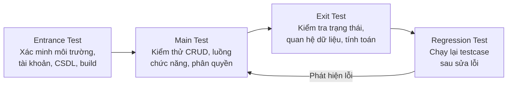
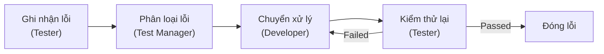
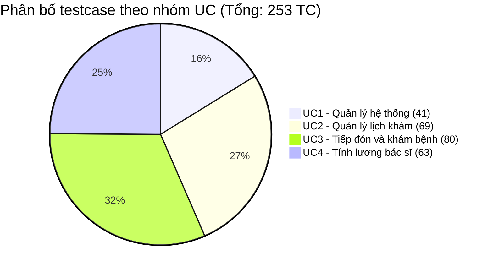

# ĐẠI HỌC PHENIKAA

## TRƯỜNG CÔNG NGHỆ THÔNG TIN

## BÀI TẬP LỚN

**HỌC PHẦN: ĐÁNH GIÁ VÀ KIỂM ĐỊNH CHẤT LƯỢNG PHẦN MỀM**

**DỰ ÁN PHÁT TRIỂN PHẦN MỀM QUẢN LÝ NHA KHOA**

# TÀI LIỆU KIỂM THỬ

**NHÓM: 07**

**Nguyễn Nhật Minh - 23010847** (Trưởng nhóm)

**Vũ Viết Tuấn - 23017097**

**Phạm Ngọc Tiến - 23010010**

**Phạm Văn Minh - 23010050**

**Tháng 6 năm 2026**

## MỤC LỤC

| DANH MỤC HÌNH ẢNH |
| --- |
| DANH MỤC BẢNG BIỂU |
| CHƯƠNG 1: KẾ HOẠCH KIỂM THỬ |
| 1.1. Giới thiệu |
| 1.1.1. Mục tiêu |
| 1.1.2. Phạm vi |
| 1.1.3. Các từ viết tắt được dùng |
| 1.1.4. Quy trình kiểm thử |
| 1.1.5. Referenced Documents |
| 1.1.6. Đối tượng sử dụng tài liệu |
| 1.2. Assumptions/dependencies |
| 1.3. Test tools |
| 1.4. Tài nguyên |
| 1.5. Yêu cầu kiểm thử |
| 1.6. Lịch trình công việc |
| 1.7. Rủi ro và giải pháp |
| 1.8. Metrics - chỉ số đánh giá |
| 1.9. Chiến lược kiểm thử |
| 1.10. Điều kiện chấp nhận |
| 1.11. Defect tracking |
| CHƯƠNG 2: XÂY DỰNG CÁC TESTCASE |
| 2.1. Xây dựng testcase cho UC1 - Quản lý hệ thống |
| 2.2. Xây dựng testcase cho UC2 - Quản lý lịch khám |
| 2.3. Xây dựng testcase cho UC3 - Tiếp đón và khám bệnh |
| 2.4. Xây dựng testcase cho UC4 - Tính lương bác sĩ |
| CHƯƠNG 3: THỰC HIỆN KIỂM THỬ VÀ CÁC KẾT QUẢ |
| CHƯƠNG 4: KIỂM THỬ TỰ ĐỘNG VÀ KIỂM THỬ PHI CHỨC NĂNG |
| CHƯƠNG 5: KẾT LUẬN |
| CHƯƠNG 6: TÀI LIỆU THAM KHẢO |

## BẢNG PHÂN CÔNG CÔNG VIỆC

| Thành viên | Lập trình | Kiểm thử | Báo cáo | Mức độ hoàn thành |
| --- | --- | --- | --- | --- |
| Nguyễn Nhật Minh (Trưởng nhóm) | UC1 - Quản lý hệ thống, cấu hình bảo mật | Thiết kế và chạy testcase UC1, smoke test, regression UC1 | Chương 1 kế hoạch kiểm thử, Chương 3 tổng hợp kết quả, tổng hợp báo cáo | 25% |
| Vũ Viết Tuấn | UC2 - Quản lý lịch khám, lịch trực, bệnh nhân | Thiết kế và chạy testcase UC2, regression UC2 | Chương 2 testcase UC2 | 25% |
| Phạm Ngọc Tiến | UC3 - Tiếp đón, khám bệnh, hóa đơn, doanh thu | Thiết kế và chạy testcase UC3, regression UC3 | Chương 2 testcase UC3, Chương 4 kiểm thử tự động | 25% |
| Phạm Văn Minh | UC4 - Tính lương, báo cáo lương, xuất Excel | Thiết kế và chạy testcase UC4, regression UC4 | Chương 2 testcase UC4, Chương 5 kết luận | 25% |

## DANH MỤC HÌNH ẢNH

Hình 2-1 Testcase cho UC1.1. Quản lý người dùng

Hình 2-2 Testcase cho UC1.2. Quản lý bác sĩ/nhân viên

Hình 2-3 Testcase cho UC1.3. Quản lý danh mục dịch vụ

Hình 2-4 Testcase cho UC1.4. Thiết lập bảng giá dịch vụ

Hình 2-5 Testcase cho UC2.1. Thiết lập các ngày nghỉ

Hình 2-6 Testcase cho UC2.2. Thiết lập ca làm việc

Hình 2-7 Testcase cho UC2.3. Quản lý phòng/ghế khám

Hình 2-8 Testcase cho UC2.4. Đăng ký lịch trực của bác sĩ

Hình 2-9 Testcase cho UC2.5. Đăng ký lịch khám của bệnh nhân

Hình 2-10 Testcase cho UC2.6. Theo dõi lịch khám

Hình 2-11 Testcase cho UC2.7. Quản lý bệnh nhân

Hình 2-12 Testcase cho UC3.1. Tiếp đón người đến khám/check-in

Hình 2-13 Testcase cho UC3.2. Quản lý hàng đợi khám

Hình 2-14 Testcase cho UC3.3. Khám bệnh và cập nhật hồ sơ

Hình 2-15 Testcase cho UC3.4. Cập nhật sơ đồ răng

Hình 2-16 Testcase cho UC3.5. Chỉ định dịch vụ trong quá trình khám

Hình 2-17 Testcase cho UC3.6. Thanh toán chi phí khám bệnh

Hình 2-18 Testcase cho UC3.7. Thống kê doanh thu

Hình 2-19 Testcase cho UC3.8. Bệnh nhân tra cứu lịch sử điều trị và hóa đơn

Hình 2-20 Testcase cho UC4.1. Thiết lập mức tiền cơ bản cho một giờ

Hình 2-21 Testcase cho UC4.2. Thiết lập hệ số ca làm việc các ngày trong tuần

Hình 2-22 Testcase cho UC4.3. Nhập hệ số các ca cần xử lý phức tạp trong tháng

Hình 2-23 Testcase cho UC4.4. Lập phiếu lương cho một bác sĩ trong 1 tháng

Hình 2-24 Testcase cho UC4.5. Báo cáo tiền lương tất cả bác sĩ trong 1 tháng

Hình 2-25 Testcase cho UC4.6. Báo cáo tiền lương của một bác sĩ trong một năm

Hình 2-26 Testcase cho UC4.7. Báo cáo tiền lương tất cả bác sĩ trong 1 năm

Hình 3-1 Bảng tổng hợp kết quả kiểm thử

## DANH MỤC BẢNG BIỂU

Bảng 1-1 Bảng thuật ngữ các từ viết tắt

Bảng 1-2 Bảng lịch trình công việc

Bảng 1-3 Bảng Test Stages

Bảng 1-4 Bảng mô tả kiểm thử chức năng

Bảng 1-5 Bảng mô tả kiểm thử phi chức năng

Bảng 1-6 Bảng mô tả kiểm thử cấu trúc

Bảng 1-7 Bảng mô tả kiểm thử thay đổi

Bảng 1-8 Bảng phân loại lỗi

Bảng 1-9 Bảng mô tả quy trình xử lý lỗi

Bảng 3-1 Bảng tổng hợp kết quả kiểm thử

# CHƯƠNG 1: KẾ HOẠCH KIỂM THỬ

## 1.1. Giới thiệu

Để hệ thống quản lý phòng khám nha khoa hoạt động chính xác, ổn định và đáp ứng đúng quy trình nghiệp vụ, việc xây dựng kế hoạch kiểm thử chi tiết là cần thiết. Tài liệu này mô tả phạm vi kiểm thử, phương pháp kiểm thử, tài nguyên, rủi ro, chỉ số đánh giá và hệ thống testcase cho các chức năng đã được cài đặt trong mã nguồn hiện tại.

Các quy trình trọng tâm cần kiểm thử bao gồm quản lý người dùng và nhân sự, quản lý lịch khám, tiếp đón và khám bệnh, hóa đơn - thanh toán, thống kê doanh thu và tính lương bác sĩ. Mục tiêu của kiểm thử là phát hiện các lỗi nghiệp vụ, lỗi nhập liệu, lỗi phân quyền, lỗi chuyển trạng thái và lỗi tính toán có thể ảnh hưởng trực tiếp đến vận hành phòng khám.

## 1.1.1. Mục tiêu

Tài liệu kế hoạch kiểm thử đưa ra các mục tiêu như sau:

- Xác định phạm vi chức năng sẽ được kiểm thử.

- Liệt kê các yêu cầu kiểm thử dựa trên đặc tả, tài liệu cài đặt và mã nguồn hiện có.

- Xác định chiến lược kiểm thử phù hợp với hệ thống Spring Boot MVC và giao diện Thymeleaf.

- Ước lượng tài nguyên, dữ liệu và tài khoản cần chuẩn bị cho kiểm thử.

- Xây dựng testcase cho các chức năng chính của hệ thống phòng khám.

- Đối chiếu testcase với các luồng nghiệp vụ quan trọng như đặt lịch, check-in, khám bệnh, thanh toán, doanh thu và lương bác sĩ.

- Phân biệt rõ testcase thiết kế với kết quả kiểm thử thực tế.

## 1.1.2. Phạm vi

## 1.1.2.1. Phạm vi sẽ kiểm thử

Tài liệu này áp dụng để kiểm thử các nhóm chức năng đã xác minh trong mã nguồn hiện tại:

- UC1. Quản lý hệ thống: quản lý người dùng, khóa/mở khóa tài khoản, reset mật khẩu, quản lý nhân viên/bác sĩ, nhóm dịch vụ, dịch vụ và bảng giá dịch vụ.

- UC2. Quản lý lịch khám: thiết lập ngày nghỉ, ca làm việc, phòng/ghế khám, lịch trực bác sĩ, đặt lịch khám, theo dõi lịch khám và quản lý bệnh nhân.

- UC3. Tiếp đón và khám bệnh: check-in, hủy check-in, hàng đợi khám, bắt đầu khám, lưu và hoàn tất phiên khám, hồ sơ bệnh án, sơ đồ răng, chỉ định dịch vụ, hóa đơn, giảm giá, thu tiền, hoàn tiền, in hóa đơn, doanh thu và portal bệnh nhân.

- UC4. Tính lương bác sĩ: thiết lập tiền giờ, hệ số ca, hệ số ca phức tạp, lập phiếu lương, tính lại, gửi duyệt, duyệt, hủy phiếu lương, báo cáo lương tháng, báo cáo lương năm và xuất Excel lương.

## 1.1.2.2. Ngoài phạm vi kiểm thử

- Kiểm thử bảo mật nâng cao ngoài phạm vi phân quyền URL hiện có.

- Kiểm thử giao diện chuyên sâu trên nhiều kích thước thiết bị nếu chưa có yêu cầu riêng.

- Kiểm thử tải lớn và kiểm thử stress test do repository hiện chưa có script kiểm thử hiệu năng chuyên dụng.

- Kiểm thử các tích hợp bên ngoài không nằm trong phạm vi mã nguồn hiện tại.

## 1.1.3. Các từ viết tắt được dùng

| STT | Từ viết tắt | Ý nghĩa |
| --- | --- | --- |
| 1 | UC | Use Case |
| 2 | TC | Test Case |
| 3 | SRS | Software Requirements Specification |
| 4 | CRUD | Create, Read, Update, Delete |
| 5 | MVC | Model View Controller |
| 6 | DB | Database |
| 7 | RBAC | Role-Based Access Control |

_Bảng 1-1 Bảng thuật ngữ các từ viết tắt_

## 1.1.4. Quy trình kiểm thử

Áp dụng các giai đoạn kiểm thử:

- Entrance Test: Xác minh môi trường, tài khoản, dữ liệu mẫu, CSDL và bản build đã sẵn sàng trước khi kiểm thử.

- Main Test: Thực hiện kiểm thử chi tiết các luồng chức năng, bao gồm CRUD, tìm kiếm/lọc, duyệt/hủy, check-in, khám bệnh, thanh toán và lương.

- Exit Test: Kiểm tra dữ liệu sau thao tác có được lưu đúng trạng thái, đúng quan hệ và đúng giá trị tính toán hay không.

- Regression Test: Chạy lại các testcase liên quan sau khi sửa lỗi hoặc cập nhật mã nguồn, đặc biệt với các nghiệp vụ có nhiều ràng buộc như lịch khám, thanh toán và phiếu lương.

## 1.1.5. Referenced Documents

- Tài liệu đặc tả use case hệ thống quản lý phòng khám.

- Tài liệu cài đặt hệ thống quản lý phòng khám.

- Code dự án `D:\PhongKham`.

- Migration/schema trong `src/main/resources/db/migration`.

- Test tự động trong `src/test/java`.

## 1.1.6. Đối tượng sử dụng tài liệu

Tài liệu này được sử dụng cho các đối tượng:

- Test Manager: Lập kế hoạch kiểm thử, theo dõi tiến độ, quản lý rủi ro và đánh giá hiệu quả kiểm thử.

- Test Designer: Thiết kế testcase, chuẩn bị dữ liệu và xác định tiêu chí kiểm thử.

- Tester: Thực hiện kiểm thử, ghi nhận kết quả và báo cáo lỗi.

- Developer: Phân tích lỗi, sửa lỗi, bổ sung test tự động và xác nhận lại kết quả.

- Người nghiệm thu: Đối chiếu chức năng hệ thống với yêu cầu nghiệp vụ trước khi nghiệm thu.

## 1.2. Assumptions/dependencies

- Dự án có thể chạy trên môi trường phát triển với Java 17, Maven và MySQL.

- Cơ sở dữ liệu đã được tạo và migration đã chạy thành công.

- Có tài khoản kiểm thử theo các vai trò ADMIN, MANAGER, RECEPTIONIST, DOCTOR và PATIENT.

- Có dữ liệu mẫu hoặc dữ liệu kiểm thử được nhập trước cho bác sĩ, bệnh nhân, dịch vụ, bảng giá, ca làm việc, lịch trực và hóa đơn.

- Người kiểm thử có quyền phù hợp với từng chức năng cần kiểm thử.

- Trong lượt hoàn thiện này, nhóm đã chạy kiểm thử thủ công toàn bộ testcase và tất cả đều đạt (Passed); ngoài ra test tự động đã được chạy bằng lệnh `C:\maven\bin\mvn.cmd -o test` và đạt 114/114 test.

## 1.3. Test tools

- Trình duyệt web: dùng để kiểm thử thủ công giao diện Thymeleaf.

- Maven: dùng để chạy test tự động của dự án.

- JUnit và Spring Boot Test: dùng cho kiểm thử tự động trong mã nguồn.

- MockMvc: dùng để kiểm thử controller, request và phân quyền ở mức web layer.

- H2: cơ sở dữ liệu in-memory dùng trong môi trường test.

- Markdown hoặc bảng tính: dùng để quản lý testcase, trạng thái thực thi và ghi chú lỗi.

## 1.4. Tài nguyên

- Nhân sự kiểm thử: Test Manager, Test Designer, Tester và Developer hỗ trợ phân tích lỗi.

- Máy tính kiểm thử có trình duyệt web và môi trường Java/Maven.

- Database MySQL cho kiểm thử thủ công và H2 cho kiểm thử tự động.

- Tài khoản kiểm thử theo từng vai trò trong hệ thống.

- Dữ liệu mẫu gồm bác sĩ, nhân viên, bệnh nhân, dịch vụ, bảng giá, phòng/ghế khám, ca làm việc, lịch trực, lịch hẹn, phiên khám, hóa đơn và phiếu lương.

- Tài liệu đặc tả, tài liệu cài đặt và mã nguồn hệ thống.

## 1.5. Yêu cầu kiểm thử

## 1.5.1. UC1 Quản lý hệ thống

- UC1.1 Quản lý người dùng: kiểm thử thêm/sửa tài khoản, khóa/mở khóa, reset mật khẩu, tìm kiếm/lọc, liên kết tài khoản với nhân viên hoặc bệnh nhân, kiểm tra trùng tên đăng nhập/email và phân quyền truy cập.

- UC1.2 Quản lý bác sĩ/nhân viên: kiểm thử thêm/sửa nhân viên, tạm khóa, kích hoạt lại, nghỉ việc, lọc theo chức vụ/trạng thái/học vị, ràng buộc số điện thoại, email, ngày sinh, ngày vào làm và thông tin bắt buộc với bác sĩ.

- UC1.3 Quản lý danh mục dịch vụ: kiểm thử nhóm dịch vụ, dịch vụ, trạng thái hoạt động/ngừng hoạt động, tìm kiếm/lọc, trùng mã/tên và đơn vị dịch vụ.

- UC1.4 Thiết lập bảng giá dịch vụ: kiểm thử tạo giá mới, ngày hiệu lực, trạng thái giá, không cho giá âm hoặc ngày hiệu lực không hợp lệ, hiển thị đúng giá đang áp dụng.

## 1.5.2. UC2 Quản lý lịch khám

- Thiết lập ngày nghỉ: kiểm thử thêm/sửa/kích hoạt/ngừng kích hoạt ngày nghỉ, kiểm tra khoảng ngày và không cho đặt lịch vào ngày nghỉ đang hoạt động.

- Thiết lập ca làm việc: kiểm thử ca theo ngày thường/cuối tuần/tất cả các ngày, thời gian bắt đầu/kết thúc, số lượng lịch tối đa và trạng thái hoạt động.

- Quản lý phòng/ghế khám: kiểm thử thêm/sửa/kích hoạt/ngừng kích hoạt phòng và ghế, kiểm tra quan hệ ghế thuộc phòng, trùng mã hoặc tên.

- Đăng ký lịch trực bác sĩ: kiểm thử bác sĩ đăng ký, quản lý duyệt/từ chối, bác sĩ hủy, kiểm tra trùng lịch trực, ngày nghỉ, ca làm việc và phòng/ghế.

- Đăng ký lịch khám bệnh nhân: kiểm thử đặt lịch bởi lễ tân và bệnh nhân, kiểm tra ngày nghỉ, ngoài ca, bác sĩ chưa có lịch trực được duyệt, trùng bác sĩ, trùng ghế, trùng bệnh nhân trong ca, quá số lượng và quá giới hạn lịch trong tuần.

- Theo dõi lịch khám: kiểm thử lọc theo tuần/ngày/bác sĩ/trạng thái và chuyển trạng thái hợp lệ của lịch hẹn.

- Quản lý bệnh nhân: kiểm thử thêm/sửa/kích hoạt/ngừng kích hoạt bệnh nhân, kiểm tra số điện thoại, email và tìm kiếm/lọc.

## 1.5.3. UC3 Tiếp đón và khám bệnh

- Check-in: kiểm thử chỉ check-in lịch đã xác nhận, không check-in trùng, nhập thông tin đến khám và hủy check-in khi được phép.

- Hàng đợi khám: kiểm thử hiển thị bệnh nhân đang chờ, gọi vào khám, bắt đầu phiên khám và cập nhật trạng thái check-in/lịch hẹn.

- Khám bệnh: kiểm thử tạo phiên khám, lưu triệu chứng, chẩn đoán, kế hoạch điều trị, ghi chú, hoàn tất khám và tạo lịch tái khám nếu người dùng nhập ngày tái khám.

- Sơ đồ răng: kiểm thử cập nhật trạng thái răng, ghi chú điều trị và xem lịch sử điều trị theo bệnh nhân.

- Chỉ định dịch vụ: kiểm thử chỉ định dịch vụ trong phiên khám, lấy giá hiện hành, tính tổng tiền, hủy dịch vụ chỉ định khi còn hiệu lực.

- Hóa đơn và thanh toán: kiểm thử lập hóa đơn từ dịch vụ đã chỉ định, giảm giá, thu tiền, hoàn tiền, in hóa đơn, trạng thái UNPAID/PARTIAL/PAID.

- Doanh thu: kiểm thử lọc theo ngày, phương thức thanh toán, tổng khoản thu, tổng hoàn tiền và doanh thu thuần.

- Portal bệnh nhân: kiểm thử bệnh nhân xem lịch hẹn, lịch sử điều trị và hóa đơn của chính mình.

## 1.5.4. UC4 Tính lương bác sĩ

- Thiết lập mức tiền theo giờ: kiểm thử thêm mới mức tiền, ngày hiệu lực, trạng thái áp dụng/hết hiệu lực/hủy.

- Thiết lập hệ số ca: kiểm thử hệ số theo ca và ngày hiệu lực, trạng thái áp dụng/hết hiệu lực/hủy.

- Hệ số ca phức tạp: kiểm thử bác sĩ đề xuất, quản lý duyệt/từ chối, lý do đề xuất và trạng thái duyệt.

- Phiếu lương: kiểm thử lập phiếu lương, kiểm tra bác sĩ/tháng/năm, không tạo trùng, không lập khi còn hệ số phức tạp chờ duyệt, tính lại, gửi duyệt, duyệt và hủy phiếu lương.

- Báo cáo lương: kiểm thử báo cáo lương tháng, báo cáo lương một bác sĩ trong năm, báo cáo lương toàn bộ bác sĩ trong năm và xuất Excel lương.

## 1.6. Lịch trình công việc

| Milestone | Deliverables | Duration | Start Date | End Date |
| --- | --- | --- | --- | --- |
| Lập kế hoạch kiểm thử UC1 | Tài liệu kế hoạch kiểm thử | Dự kiến 1 ngày | Dự kiến | Dự kiến |
| Thiết kế testcase UC1 | Bộ testcase quản lý hệ thống | Dự kiến 2 ngày | Dự kiến | Dự kiến |
| Lập kế hoạch kiểm thử UC2 | Tài liệu kế hoạch kiểm thử | Dự kiến 1 ngày | Dự kiến | Dự kiến |
| Thiết kế testcase UC2 | Bộ testcase quản lý lịch khám | Dự kiến 3 ngày | Dự kiến | Dự kiến |
| Lập kế hoạch kiểm thử UC3 | Tài liệu kế hoạch kiểm thử | Dự kiến 1 ngày | Dự kiến | Dự kiến |
| Thiết kế testcase UC3 | Bộ testcase tiếp đón, khám bệnh, thanh toán | Dự kiến 3 ngày | Dự kiến | Dự kiến |
| Lập kế hoạch kiểm thử UC4 | Tài liệu kế hoạch kiểm thử | Dự kiến 1 ngày | Dự kiến | Dự kiến |
| Thiết kế testcase UC4 | Bộ testcase tính lương bác sĩ | Dự kiến 2 ngày | Dự kiến | Dự kiến |
| Thực thi testcase và ghi nhận lỗi | Báo cáo kết quả kiểm thử | Dự kiến 4 ngày | Dự kiến | Dự kiến |

_Bảng 1-2 Bảng lịch trình công việc_

## 1.7. Rủi ro và giải pháp

| Rủi ro | Giải pháp |
| --- | --- |
| Thiếu dữ liệu mẫu cho bác sĩ, bệnh nhân, lịch trực, hóa đơn hoặc phiếu lương | Chuẩn bị dữ liệu seed hoặc nhập tay dữ liệu kiểm thử trước khi chạy testcase |
| Giao diện thay đổi khi đang kiểm thử | Cập nhật lại bước thao tác và dữ liệu đầu vào trong testcase |
| Logic đặt lịch có nhiều điều kiện phụ thuộc ngày nghỉ, ca làm việc, bác sĩ, ghế và bệnh nhân | Thiết kế dữ liệu kiểm thử riêng cho từng điều kiện và kiểm tra cả luồng lỗi |
| Logic thanh toán và lương nhạy cảm với số tiền và trạng thái | Kiểm tra lại dữ liệu nguồn, công thức tính và trạng thái sau mỗi thao tác |
| Kết quả kiểm thử thủ công phụ thuộc dữ liệu và môi trường | Ghi nhận trung thực trạng thái từng testcase; chỉ kết luận đạt khi kết quả thực tế khớp Expected Result |
| Test tự động chưa bao phủ hết thao tác UI thủ công | Bổ sung testcase thủ công cho các luồng chưa có test tự động |

## 1.8. Metrics - chỉ số đánh giá

| Tên chỉ số | Mục đích |
| --- | --- |
| Số testcase thiết kế | Đánh giá mức độ bao phủ kế hoạch kiểm thử |
| Số testcase đã chạy | Theo dõi tiến độ thực hiện kiểm thử |
| Tỷ lệ pass/fail | Đánh giá chất lượng sau khi đã chạy test thực tế |
| Số lỗi theo mức độ nghiêm trọng | Phân tích rủi ro và ưu tiên sửa lỗi |
| Tỷ lệ bao phủ UC | Đánh giá số UC đã có testcase |
| Số UC có test tự động | Đánh giá mức độ hỗ trợ kiểm thử hồi quy |
| Số UC chưa có test tự động | Xác định vùng cần bổ sung test |

## 1.9. Chiến lược kiểm thử

## 1.9.1. Test Stages

| Giai đoạn | Mô tả | Các bước kiểm thử | Áp dụng cho |
| --- | --- | --- | --- |
| Kiểm thử hộp đen | Kiểm tra chức năng từ góc nhìn người dùng, không phụ thuộc vào mã nguồn | Phân tích yêu cầu, thiết kế dữ liệu, thao tác trên giao diện, so sánh kết quả mong đợi | CRUD, đặt lịch, check-in, thanh toán, báo cáo |
| Kiểm thử hộp trắng | Đọc mã nguồn để xác định nhánh xử lý, ràng buộc và trạng thái cần kiểm thử | Đọc controller, service, repository, entity, enum; thiết kế testcase theo điều kiện trong code | Luồng đặt lịch, hóa đơn, lương, phân quyền |
| Kiểm thử thủ công | Tester thao tác trực tiếp trên giao diện hệ thống | Đăng nhập, nhập dữ liệu, thực hiện thao tác, ghi nhận kết quả | Tất cả UC |
| Kiểm thử tự động | Chạy test JUnit/MockMvc/service test có trong mã nguồn | Chuẩn bị profile test, chạy Maven test, ghi nhận kết quả | Smoke, regression, service test |
| Kiểm thử hồi quy | Kiểm tra lại chức năng sau khi sửa lỗi hoặc cập nhật | Chạy lại testcase liên quan và các test tự động đã có | UC1, UC2, UC3, UC4 |

_Bảng 1-3 Bảng Test Stages_

## 1.9.2. Các loại kiểm thử

## 1.9.2.1. Kiểm thử chức năng

| Mục | Nội dung |
| --- | --- |
| Mục đích | Xác minh hệ thống thực hiện đúng chức năng đã cài đặt |
| Kỹ thuật | Kiểm thử hộp đen, phân lớp tương đương, giá trị biên, kiểm thử trạng thái |
| Tiêu chuẩn dừng | Hoàn thành thực thi các testcase thuộc phạm vi kiểm thử và ghi nhận đầy đủ lỗi |
| Chịu trách nhiệm | Tester phối hợp với Developer |
| Cách kiểm thử | Thao tác theo từng testcase trên giao diện hoặc chạy test tự động tương ứng |
| Xử lý ngoại lệ | Ghi nhận lỗi, dữ liệu đầu vào, tài khoản sử dụng, màn hình và bước tái hiện |

_Bảng 1-4 Bảng mô tả kiểm thử chức năng_

## 1.9.2.2. Kiểm thử phi chức năng

| Mục | Nội dung |
| --- | --- |
| Mục đích | Đánh giá khả năng sử dụng, phản hồi và ổn định ở mức kế hoạch |
| Kỹ thuật | Quan sát giao diện, kiểm tra phản hồi trang, rà soát lỗi hiển thị và lỗi máy chủ |
| Tiêu chuẩn dừng | Các màn hình chính hiển thị được, không lỗi 500 với dữ liệu hợp lệ |
| Chịu trách nhiệm | Tester và Developer |
| Cách kiểm thử | Kiểm thử thủ công kết hợp chạy smoke/regression test |
| Ghi chú | Tài liệu này không ghi kết quả hiệu năng thực tế vì chưa chạy kiểm thử hiệu năng chuyên dụng |

_Bảng 1-5 Bảng mô tả kiểm thử phi chức năng_

## 1.9.2.3. Kiểm thử cấu trúc

| Mục | Nội dung |
| --- | --- |
| Mục đích | Kiểm tra cấu trúc xử lý controller - service - repository - entity có phù hợp với nghiệp vụ |
| Kỹ thuật | Đọc mã nguồn, xác định nhánh validate, trạng thái, quan hệ dữ liệu và test service |
| Tiêu chuẩn dừng | Các nhánh xử lý quan trọng đã có testcase hoặc ghi nhận cần bổ sung |
| Chịu trách nhiệm | Developer và Test Designer |
| Cách kiểm thử | Đối chiếu code với đặc tả và các testcase ở Chương 2 |

_Bảng 1-6 Bảng mô tả kiểm thử cấu trúc_

## 1.9.2.4. Kiểm thử thay đổi

| Mục | Nội dung |
| --- | --- |
| Mục đích | Bảo đảm các thay đổi không làm hỏng chức năng đã có |
| Kỹ thuật | Chạy lại regression test và testcase thủ công liên quan |
| Tiêu chuẩn dừng | Không phát sinh lỗi mới ở các luồng đã ổn định |
| Chịu trách nhiệm | Tester và Developer |
| Cách kiểm thử | Chạy Phase regression test, kiểm tra lại luồng nghiệp vụ bị ảnh hưởng |

_Bảng 1-7 Bảng mô tả kiểm thử thay đổi_

## 1.9.2.5. Kiểm thử phân quyền

Kiểm thử phân quyền tập trung vào các vai trò có trong hệ thống: Admin, Quản lý, Lễ tân, Bác sĩ và Bệnh nhân. Các testcase cần xác minh người dùng chỉ truy cập được chức năng đúng với vai trò, các URL không thuộc quyền bị từ chối và tài khoản chưa đăng nhập bị chuyển về màn hình đăng nhập.

## 1.9.2.6. Kiểm thử nghiệp vụ tài chính

Kiểm thử nghiệp vụ tài chính tập trung vào hóa đơn, giảm giá, thu tiền, hoàn tiền, doanh thu, phiếu lương và xuất Excel lương. Các testcase cần kiểm tra số tiền không âm, không vượt số tiền còn lại, trạng thái hóa đơn sau thu/hoàn tiền, công thức tính lương theo giờ quy đổi và tính đúng báo cáo lương.

## 1.10. Điều kiện chấp nhận

- Các testcase critical cho đặt lịch, check-in, khám bệnh, thanh toán và phiếu lương phải được thiết kế đầy đủ.

- Khi thực thi kiểm thử, các testcase critical phải đạt kết quả mong đợi.

- Không còn lỗi High trước khi nghiệm thu.

- Phân quyền phải đúng theo vai trò người dùng.

- Hệ thống không cho phép thao tác sai trạng thái nghiệp vụ.

- Số tiền hóa đơn, doanh thu và lương phải tính đúng theo dữ liệu nguồn và công thức trong code.

- Báo cáo phải khớp với dữ liệu hóa đơn, thanh toán và phiếu lương.

## 1.11. Defect tracking

## 1.11.1. Phân loại lỗi

| Mức độ nghiêm trọng | Đặc tả lỗi |
| --- | --- |
| High | Lỗi làm dừng luồng chính hoặc làm sai dữ liệu quan trọng như không đặt lịch được, check-in sai trạng thái, sai tổng tiền hóa đơn, sai lương bác sĩ, truy cập sai quyền |
| Medium | Lỗi ảnh hưởng đến một phần nghiệp vụ như lọc sai danh sách, thông báo chưa đúng, chuyển trạng thái chưa đúng trong trường hợp phụ |
| Low | Lỗi hiển thị, lỗi chính tả, bố cục chưa rõ hoặc thông tin hướng dẫn chưa đủ nhưng không làm sai dữ liệu |

_Bảng 1-8 Bảng phân loại lỗi_

## 1.11.2. Quy trình xử lý lỗi

| Quy trình | Mô tả |
| --- | --- |
| Ghi nhận lỗi | Tester ghi lại mã testcase, dữ liệu đầu vào, tài khoản, bước tái hiện và kết quả thực tế |
| Phân loại lỗi | Test Manager xác định mức độ nghiêm trọng và nhóm chức năng bị ảnh hưởng |
| Chuyển xử lý | Developer phân tích nguyên nhân và sửa lỗi |
| Kiểm thử lại | Tester chạy lại testcase lỗi và các testcase hồi quy liên quan |
| Đóng lỗi | Lỗi được đóng khi kết quả thực tế khớp với kết quả mong đợi |

_Bảng 1-9 Bảng mô tả quy trình xử lý lỗi_

# CHƯƠNG 2: XÂY DỰNG CÁC TESTCASE

Các testcase trong chương này được thiết kế dựa trên chức năng có trong mã nguồn hiện tại và đã được nhóm thực thi kiểm thử thủ công thực tế, toàn bộ cho kết quả đạt (`Passed`). Danh sách testcase đầy đủ và số lượng chính thức được quản lý trong file Excel `docs/testcase-he-thong-quan-ly-phong-kham.xlsx`.

## 2.1. Xây dựng testcase cho UC1 - Quản lý hệ thống

## 2.1.1. Xây dựng testcase cho UC1.1. Quản lý người dùng

_Hình 2-1 Testcase cho UC1.1. Quản lý người dùng_

| Test Case ID | Test Case Description | Test Procedures | Test Input Value | Expected Result | Status |
| --- | --- | --- | --- | --- | --- |
| UC1.1_FUNC_001 | Thêm mới người dùng hợp lệ | Đăng nhập Admin, mở Người dùng, chọn thêm mới, nhập thông tin và lưu | Username mới, email mới, mật khẩu hợp lệ, role hợp lệ | Tài khoản được tạo, hiển thị trong danh sách, trạng thái hoạt động | Passed |
| UC1.1_VALID_001 | Thêm người dùng thiếu trường bắt buộc | Mở form thêm người dùng, bỏ trống username hoặc role, bấm lưu | Username rỗng hoặc role rỗng | Hệ thống hiển thị lỗi và không tạo tài khoản | Passed |
| UC1.1_VALID_002 | Thêm người dùng có email trùng | Nhập email đã tồn tại rồi lưu | Email đang được dùng bởi tài khoản khác | Hệ thống báo dữ liệu đã tồn tại | Passed |
| UC1.1_VALID_003 | Reset mật khẩu với mật khẩu xác nhận không khớp | Chọn tài khoản, mở reset mật khẩu, nhập hai mật khẩu khác nhau | New password khác confirm password | Hệ thống báo lỗi và không đổi mật khẩu | Passed |
| UC1.1_STATE_001 | Khóa tài khoản đang hoạt động | Chọn tài khoản ACTIVE, nhập lý do khóa, xác nhận | Lý do khóa hợp lệ | Tài khoản chuyển sang LOCKED và không đăng nhập được | Passed |
| UC1.1_STATE_002 | Mở khóa tài khoản đã khóa | Chọn tài khoản LOCKED và xác nhận mở khóa | Tài khoản đang khóa | Tài khoản chuyển sang ACTIVE | Passed |
| UC1.1_AUTH_001 | Người không phải Admin truy cập quản lý người dùng | Đăng nhập bằng vai trò khác và mở màn hình Người dùng | Tài khoản không có role ADMIN | Hệ thống từ chối truy cập | Passed |

## 2.1.2. Xây dựng testcase cho UC1.2. Quản lý bác sĩ/nhân viên

_Hình 2-2 Testcase cho UC1.2. Quản lý bác sĩ/nhân viên_

| Test Case ID | Test Case Description | Test Procedures | Test Input Value | Expected Result | Status |
| --- | --- | --- | --- | --- | --- |
| UC1.2_FUNC_001 | Thêm nhân viên/bác sĩ hợp lệ | Đăng nhập Admin/Quản lý, mở Nhân viên, nhập thông tin và lưu | Họ tên, ngày sinh, điện thoại, email, chức vụ, ngày vào làm, học vị nếu là bác sĩ | Nhân viên được tạo và hiển thị trong danh sách | Passed |
| UC1.2_VALID_001 | Thêm bác sĩ thiếu chuyên khoa hoặc học vị | Chọn chức vụ Bác sĩ, bỏ trống chuyên khoa hoặc học vị, lưu | Position = DOCTOR, specialty rỗng hoặc degree rỗng | Hệ thống hiển thị lỗi và không lưu | Passed |
| UC1.2_VALID_002 | Nhập số điện thoại sai định dạng | Tạo/sửa nhân viên với số điện thoại không bắt đầu bằng 0 hoặc không đủ 10 số | Phone = 12345 | Hệ thống báo lỗi số điện thoại | Passed |
| UC1.2_VALID_003 | Nhập email hoặc số điện thoại trùng | Tạo nhân viên với email/phone đã tồn tại | Email hoặc phone đã dùng | Hệ thống báo dữ liệu đã được sử dụng | Passed |
| UC1.2_STATE_001 | Tạm khóa và kích hoạt lại nhân viên | Chọn nhân viên đang làm việc, tạm khóa, sau đó kích hoạt lại | Nhân viên ACTIVE | Trạng thái chuyển SUSPENDED rồi quay lại ACTIVE | Passed |
| UC1.2_AUTH_001 | Lễ tân truy cập quản lý nhân viên | Đăng nhập Lễ tân và mở màn hình Nhân viên | Role RECEPTIONIST | Hệ thống từ chối truy cập | Passed |

## 2.1.3. Xây dựng testcase cho UC1.3. Quản lý danh mục dịch vụ

_Hình 2-3 Testcase cho UC1.3. Quản lý danh mục dịch vụ_

| Test Case ID | Test Case Description | Test Procedures | Test Input Value | Expected Result | Status |
| --- | --- | --- | --- | --- | --- |
| UC1.3_FUNC_001 | Thêm nhóm dịch vụ hợp lệ | Mở Dịch vụ, nhập thông tin nhóm dịch vụ và lưu | Mã/tên nhóm mới, trạng thái ACTIVE | Nhóm dịch vụ được tạo | Passed |
| UC1.3_FUNC_002 | Thêm dịch vụ hợp lệ | Chọn nhóm dịch vụ, nhập tên, đơn vị, trạng thái và lưu | Dịch vụ mới, đơn vị hợp lệ | Dịch vụ được tạo trong nhóm đã chọn | Passed |
| UC1.3_VALID_001 | Thêm nhóm dịch vụ trùng tên hoặc mã | Nhập mã/tên nhóm đã tồn tại | Mã/tên nhóm trùng | Hệ thống báo lỗi dữ liệu trùng | Passed |
| UC1.3_VALID_002 | Thêm dịch vụ thiếu nhóm hoặc tên dịch vụ | Bỏ trống nhóm hoặc tên dịch vụ rồi lưu | Category rỗng hoặc service name rỗng | Hệ thống hiển thị lỗi validate | Passed |
| UC1.3_FUNC_003 | Tìm kiếm/lọc dịch vụ | Nhập từ khóa, đơn vị hoặc trạng thái để lọc | Keyword, unit, status | Danh sách chỉ hiển thị dịch vụ phù hợp | Passed |
| UC1.3_AUTH_001 | Bác sĩ truy cập quản lý dịch vụ | Đăng nhập Bác sĩ và mở màn hình Dịch vụ | Role DOCTOR | Hệ thống từ chối truy cập | Passed |

## 2.1.4. Xây dựng testcase cho UC1.4. Thiết lập bảng giá dịch vụ

_Hình 2-4 Testcase cho UC1.4. Thiết lập bảng giá dịch vụ_

| Test Case ID | Test Case Description | Test Procedures | Test Input Value | Expected Result | Status |
| --- | --- | --- | --- | --- | --- |
| UC1.4_FUNC_001 | Thêm giá dịch vụ hợp lệ | Mở Bảng giá dịch vụ, chọn dịch vụ, nhập giá và ngày hiệu lực, lưu | Dịch vụ ACTIVE, giá > 0, effectiveDate hợp lệ | Bảng giá được tạo và hiển thị trong danh sách | Passed |
| UC1.4_VALID_001 | Thêm giá với số tiền không hợp lệ | Nhập giá bằng 0 hoặc số âm rồi lưu | Price <= 0 | Hệ thống báo lỗi và không lưu | Passed |
| UC1.4_VALID_002 | Thêm giá thiếu dịch vụ hoặc ngày hiệu lực | Bỏ trống dịch vụ/ngày hiệu lực rồi lưu | Service rỗng hoặc effectiveDate rỗng | Hệ thống báo lỗi bắt buộc nhập | Passed |
| UC1.4_FUNC_002 | Lọc bảng giá theo dịch vụ và trạng thái | Chọn bộ lọc dịch vụ, trạng thái, khoảng ngày | Service, priceStatus, date range | Danh sách bảng giá phù hợp tiêu chí | Passed |
| UC1.4_AUTH_001 | Bệnh nhân truy cập bảng giá nội bộ | Đăng nhập Bệnh nhân và mở màn hình Bảng giá | Role PATIENT | Hệ thống từ chối truy cập | Passed |

## 2.2. Xây dựng testcase cho UC2 - Quản lý lịch khám

## 2.2.1. Xây dựng testcase cho UC2.1. Thiết lập các ngày nghỉ

_Hình 2-5 Testcase cho UC2.1. Thiết lập các ngày nghỉ_

| Test Case ID | Test Case Description | Test Procedures | Test Input Value | Expected Result | Status |
| --- | --- | --- | --- | --- | --- |
| UC2.1_FUNC_001 | Thêm ngày nghỉ hợp lệ | Admin/Quản lý mở Ngày nghỉ, nhập tên, loại, từ ngày, đến ngày, lưu | Ngày hợp lệ, loại ngày nghỉ hợp lệ | Ngày nghỉ được tạo ở trạng thái hoạt động | Passed |
| UC2.1_VALID_001 | Thêm ngày nghỉ có ngày kết thúc trước ngày bắt đầu | Nhập fromDate sau toDate rồi lưu | FromDate > ToDate | Hệ thống báo lỗi khoảng ngày | Passed |
| UC2.1_VALID_002 | Thêm ngày nghỉ trùng mã hoặc trùng khoảng theo ràng buộc | Nhập thông tin trùng dữ liệu đã có | Dữ liệu trùng | Hệ thống báo lỗi và không lưu | Passed |
| UC2.1_STATE_001 | Ngừng kích hoạt ngày nghỉ | Chọn ngày nghỉ ACTIVE, bấm ngừng kích hoạt | Holiday ACTIVE | Holiday chuyển INACTIVE | Passed |
| UC2.1_AUTH_001 | Lễ tân truy cập thiết lập ngày nghỉ | Đăng nhập Lễ tân, mở Ngày nghỉ | Role RECEPTIONIST | Hệ thống từ chối truy cập | Passed |

## 2.2.2. Xây dựng testcase cho UC2.2. Thiết lập ca làm việc

_Hình 2-6 Testcase cho UC2.2. Thiết lập ca làm việc_

| Test Case ID | Test Case Description | Test Procedures | Test Input Value | Expected Result | Status |
| --- | --- | --- | --- | --- | --- |
| UC2.2_FUNC_001 | Thêm ca làm việc hợp lệ | Mở Ca làm việc, nhập tên ca, giờ bắt đầu, giờ kết thúc, loại ngày và số lịch tối đa | StartTime < EndTime, maxAppointments hợp lệ | Ca làm việc được tạo | Passed |
| UC2.2_VALID_001 | Thêm ca có giờ kết thúc không sau giờ bắt đầu | Nhập thời gian không hợp lệ rồi lưu | EndTime <= StartTime | Hệ thống báo lỗi thời gian | Passed |
| UC2.2_VALID_002 | Thêm ca thiếu tên hoặc thời gian | Bỏ trống tên/giờ bắt đầu/giờ kết thúc | Required field rỗng | Hệ thống báo lỗi bắt buộc nhập | Passed |
| UC2.2_STATE_001 | Ngừng kích hoạt ca làm việc | Chọn ca ACTIVE, bấm ngừng kích hoạt | WorkShift ACTIVE | Ca chuyển INACTIVE | Passed |
| UC2.2_AUTH_001 | Bác sĩ truy cập thiết lập ca làm việc | Đăng nhập Bác sĩ, mở Ca làm việc | Role DOCTOR | Hệ thống từ chối truy cập | Passed |

## 2.2.3. Xây dựng testcase cho UC2.3. Quản lý phòng/ghế khám

_Hình 2-7 Testcase cho UC2.3. Quản lý phòng/ghế khám_

| Test Case ID | Test Case Description | Test Procedures | Test Input Value | Expected Result | Status |
| --- | --- | --- | --- | --- | --- |
| UC2.3_FUNC_001 | Thêm phòng khám hợp lệ | Mở Phòng/Ghế, nhập mã phòng, tên phòng, trạng thái, lưu | Mã phòng mới, tên phòng mới | Phòng khám được tạo | Passed |
| UC2.3_FUNC_002 | Thêm ghế nha khoa hợp lệ | Chọn phòng, nhập mã ghế, tên ghế, trạng thái, lưu | Room ACTIVE, mã ghế mới | Ghế được tạo và gắn với phòng | Passed |
| UC2.3_VALID_001 | Thêm phòng/ghế trùng mã | Nhập mã đã tồn tại rồi lưu | Room code hoặc chair code trùng | Hệ thống báo lỗi trùng mã | Passed |
| UC2.3_STATE_001 | Ngừng sử dụng phòng hoặc ghế | Chọn phòng/ghế ACTIVE, bấm ngừng sử dụng | Room/Chair ACTIVE | Trạng thái chuyển INACTIVE hoặc MAINTENANCE theo dữ liệu | Passed |
| UC2.3_AUTH_001 | Lễ tân truy cập quản lý phòng/ghế | Đăng nhập Lễ tân và mở Phòng/Ghế | Role RECEPTIONIST | Hệ thống từ chối truy cập | Passed |

## 2.2.4. Xây dựng testcase cho UC2.4. Đăng ký lịch trực của bác sĩ

_Hình 2-8 Testcase cho UC2.4. Đăng ký lịch trực của bác sĩ_

| Test Case ID | Test Case Description | Test Procedures | Test Input Value | Expected Result | Status |
| --- | --- | --- | --- | --- | --- |
| UC2.4_FUNC_001 | Bác sĩ đăng ký lịch trực hợp lệ | Đăng nhập Bác sĩ, chọn ngày, ca, phòng, ghế, gửi đăng ký | Ngày làm việc, ca ACTIVE, phòng/ghế ACTIVE | Lịch trực được tạo ở trạng thái REGISTERED | Passed |
| UC2.4_VALID_001 | Đăng ký lịch trực vào ngày nghỉ | Chọn ngày đang là ngày nghỉ hoạt động | WorkDate thuộc holiday ACTIVE | Hệ thống báo lỗi không cho đăng ký | Passed |
| UC2.4_VALID_002 | Đăng ký trùng lịch trực | Tạo lịch trực trùng bác sĩ/ngày/ca hoặc trùng ghế | Dữ liệu trùng | Hệ thống báo lỗi trùng lịch | Passed |
| UC2.4_STATE_001 | Quản lý duyệt lịch trực | Đăng nhập Admin/Quản lý, chọn lịch REGISTERED, duyệt | Lịch trực REGISTERED | Trạng thái chuyển APPROVED | Passed |
| UC2.4_STATE_002 | Quản lý từ chối lịch trực | Chọn lịch REGISTERED, nhập lý do từ chối | Lịch trực REGISTERED, reason hợp lệ | Trạng thái chuyển REJECTED | Passed |
| UC2.4_STATE_003 | Bác sĩ hủy lịch trực khi được phép | Chọn lịch trực chưa bị hủy, xác nhận hủy | Lịch chưa CANCELLED | Trạng thái chuyển CANCELLED nếu không vi phạm ràng buộc | Passed |

## 2.2.5. Xây dựng testcase cho UC2.5. Đăng ký lịch khám của bệnh nhân

_Hình 2-9 Testcase cho UC2.5. Đăng ký lịch khám của bệnh nhân_

| Test Case ID | Test Case Description | Test Procedures | Test Input Value | Expected Result | Status |
| --- | --- | --- | --- | --- | --- |
| UC2.5_FUNC_001 | Lễ tân tạo lịch khám hợp lệ cho bệnh nhân có sẵn | Đăng nhập Lễ tân, mở Lịch khám, chọn bệnh nhân, bác sĩ, ngày, ca, giờ đến, lưu | Bệnh nhân có sẵn, bác sĩ có lịch trực APPROVED | Lịch hẹn được tạo ở trạng thái PENDING | Passed |
| UC2.5_FUNC_002 | Lễ tân tạo lịch khám kèm bệnh nhân mới | Nhập thông tin bệnh nhân mới và thông tin lịch hẹn | Họ tên, phone hợp lệ, ngày khám hợp lệ | Bệnh nhân mới và lịch hẹn được tạo | Passed |
| UC2.5_FUNC_003 | Bệnh nhân tự đặt lịch qua portal | Đăng nhập Bệnh nhân, mở Đặt lịch, chọn dịch vụ/bác sĩ/ngày/ca, lưu | Tài khoản PATIENT, dữ liệu hợp lệ | Lịch hẹn nguồn PATIENT_ONLINE được tạo | Passed |
| UC2.5_VALID_001 | Đặt lịch vào ngày nghỉ | Chọn ngày thuộc ngày nghỉ đang hoạt động | AppointmentDate là holiday ACTIVE | Hệ thống báo lỗi ngày nghỉ | Passed |
| UC2.5_VALID_002 | Đặt lịch ngoài khung giờ ca | Chọn giờ đến trước giờ bắt đầu hoặc sau giờ kết thúc ca | ArrivalTime ngoài WorkShift | Hệ thống báo lỗi giờ đến | Passed |
| UC2.5_VALID_003 | Đặt lịch khi bác sĩ chưa có lịch trực được duyệt | Chọn bác sĩ/ngày/ca không có lịch trực APPROVED | Không có DoctorShiftRegistration APPROVED | Hệ thống báo bác sĩ chưa có lịch trực được duyệt | Passed |
| UC2.5_VALID_004 | Đặt lịch trùng lịch bác sĩ | Tạo lịch cùng bác sĩ/ngày/khung giờ đã có lịch khác | Doctor conflict | Hệ thống báo bác sĩ đã có lịch trùng | Passed |
| UC2.5_VALID_005 | Đặt lịch trùng ghế nha khoa | Chọn lịch trực có ghế đang được dùng trong khung giờ | Chair conflict | Hệ thống báo ghế đã được sử dụng | Passed |
| UC2.5_VALID_006 | Đặt lịch trùng bệnh nhân trong cùng ca | Tạo lịch cho bệnh nhân đã có lịch cùng ngày/ca | Patient conflict | Hệ thống báo bệnh nhân đã có lịch trong ca | Passed |
| UC2.5_AUTH_001 | Bệnh nhân truy cập màn hình quản lý lịch khám nội bộ | Đăng nhập Bệnh nhân, mở màn hình Lịch khám nội bộ | Role PATIENT | Hệ thống từ chối truy cập | Passed |

## 2.2.6. Xây dựng testcase cho UC2.6. Theo dõi lịch khám

_Hình 2-10 Testcase cho UC2.6. Theo dõi lịch khám_

| Test Case ID | Test Case Description | Test Procedures | Test Input Value | Expected Result | Status |
| --- | --- | --- | --- | --- | --- |
| UC2.6_FUNC_001 | Lọc lịch khám theo tuần | Mở Theo dõi lịch khám, chọn tuần cần xem | Week start/end | Hệ thống hiển thị lịch trong tuần | Passed |
| UC2.6_FUNC_002 | Lọc lịch khám theo bác sĩ và trạng thái | Chọn bác sĩ và trạng thái | DoctorId, AppointmentStatus | Danh sách chỉ còn lịch phù hợp | Passed |
| UC2.6_STATE_001 | Chuyển lịch từ PENDING sang CONFIRMED | Chọn lịch PENDING, cập nhật trạng thái CONFIRMED | Appointment PENDING | Lịch chuyển CONFIRMED | Passed |
| UC2.6_STATE_002 | Hủy lịch hẹn yêu cầu lý do | Chọn lịch có thể hủy, chọn CANCELLED nhưng bỏ trống lý do | CancelReason rỗng | Hệ thống báo lỗi lý do hủy | Passed |
| UC2.6_STATE_003 | Không cho đổi trạng thái lịch đã hoàn tất | Chọn lịch COMPLETED và cập nhật trạng thái | Appointment COMPLETED | Hệ thống từ chối thay đổi | Passed |

## 2.2.7. Xây dựng testcase cho UC2.7. Quản lý bệnh nhân

_Hình 2-11 Testcase cho UC2.7. Quản lý bệnh nhân_

| Test Case ID | Test Case Description | Test Procedures | Test Input Value | Expected Result | Status |
| --- | --- | --- | --- | --- | --- |
| UC2.7_FUNC_001 | Thêm bệnh nhân hợp lệ | Lễ tân mở Bệnh nhân, nhập thông tin và lưu | Họ tên, phone hợp lệ, ngày sinh, giới tính | Bệnh nhân được tạo và hiển thị | Passed |
| UC2.7_VALID_001 | Thêm bệnh nhân thiếu họ tên hoặc số điện thoại | Bỏ trống họ tên/phone rồi lưu | Required field rỗng | Hệ thống hiển thị lỗi | Passed |
| UC2.7_VALID_002 | Thêm bệnh nhân có số điện thoại trùng | Nhập phone đã tồn tại | Phone trùng | Hệ thống báo dữ liệu đã tồn tại | Passed |
| UC2.7_STATE_001 | Ngừng kích hoạt và kích hoạt lại bệnh nhân | Chọn bệnh nhân ACTIVE, ngừng kích hoạt, sau đó kích hoạt lại | Patient ACTIVE | Trạng thái thay đổi đúng | Passed |
| UC2.7_AUTH_001 | Bác sĩ truy cập quản lý bệnh nhân nội bộ | Đăng nhập Bác sĩ, mở màn hình Bệnh nhân | Role DOCTOR | Hệ thống từ chối truy cập | Passed |

## 2.3. Xây dựng testcase cho UC3 - Tiếp đón và khám bệnh

## 2.3.1. Xây dựng testcase cho UC3.1. Tiếp đón người đến khám/check-in

_Hình 2-12 Testcase cho UC3.1. Tiếp đón người đến khám/check-in_

| Test Case ID | Test Case Description | Test Procedures | Test Input Value | Expected Result | Status |
| --- | --- | --- | --- | --- | --- |
| UC3.1_FUNC_001 | Check-in lịch hẹn đã xác nhận | Đăng nhập Lễ tân, mở Check-in, chọn lịch CONFIRMED, nhập thông tin đến khám, lưu | Appointment CONFIRMED | Tạo VisitCheckin trạng thái WAITING, lịch chuyển CHECKED_IN | Passed |
| UC3.1_VALID_001 | Check-in lịch chưa xác nhận | Chọn lịch PENDING để check-in | Appointment PENDING | Hệ thống báo chỉ lịch đã xác nhận mới được check-in | Passed |
| UC3.1_VALID_002 | Check-in trùng một lịch hẹn | Check-in lại lịch đã có check-in chưa hủy | Appointment đã có checkin | Hệ thống báo đã check-in | Passed |
| UC3.1_VALID_003 | Check-in thiếu lịch hẹn | Gửi form check-in không chọn lịch | AppointmentId rỗng | Hệ thống báo thiếu thông tin lịch hẹn | Passed |
| UC3.1_FUNC_002 | Ghi nhận bệnh nhân đến muộn | Check-in với trạng thái đến muộn nếu form hỗ trợ | ArrivalStatus = LATE | Check-in lưu trạng thái đến muộn | Passed |
| UC3.1_STATE_001 | Hủy check-in đang chờ | Chọn check-in WAITING, nhập lý do hủy và xác nhận | Checkin WAITING | Check-in chuyển CANCELLED | Passed |
| UC3.1_STATE_002 | Không hủy check-in đã vào khám | Chọn check-in IN_EXAM hoặc DONE, thực hiện hủy | Checkin không còn WAITING | Hệ thống từ chối hủy | Passed |
| UC3.1_AUTH_001 | Bệnh nhân truy cập màn hình check-in nội bộ | Đăng nhập Bệnh nhân, mở Check-in | Role PATIENT | Hệ thống từ chối truy cập | Passed |

## 2.3.2. Xây dựng testcase cho UC3.2. Quản lý hàng đợi khám

_Hình 2-13 Testcase cho UC3.2. Quản lý hàng đợi khám_

| Test Case ID | Test Case Description | Test Procedures | Test Input Value | Expected Result | Status |
| --- | --- | --- | --- | --- | --- |
| UC3.2_FUNC_001 | Hiển thị danh sách bệnh nhân đang chờ | Mở Hàng đợi khám | Checkin WAITING | Hệ thống hiển thị danh sách bệnh nhân chờ khám | Passed |
| UC3.2_FUNC_002 | Bác sĩ bắt đầu khám từ hàng đợi | Chọn check-in WAITING, bấm bắt đầu khám | Checkin WAITING | Tạo/mở TreatmentSession, check-in chuyển IN_EXAM | Passed |
| UC3.2_STATE_001 | Không bắt đầu khám với check-in đã hủy | Chọn check-in CANCELLED, bấm bắt đầu khám | Checkin CANCELLED | Hệ thống từ chối thao tác | Passed |
| UC3.2_FUNC_003 | Lọc hàng đợi theo ngày | Chọn ngày cần xem hàng đợi | Queue date | Danh sách hiển thị đúng ngày | Passed |
| UC3.2_AUTH_001 | Bệnh nhân truy cập hàng đợi nội bộ | Đăng nhập Bệnh nhân, mở Hàng đợi | Role PATIENT | Hệ thống từ chối truy cập | Passed |

## 2.3.3. Xây dựng testcase cho UC3.3. Khám bệnh và cập nhật hồ sơ

_Hình 2-14 Testcase cho UC3.3. Khám bệnh và cập nhật hồ sơ_

| Test Case ID | Test Case Description | Test Procedures | Test Input Value | Expected Result | Status |
| --- | --- | --- | --- | --- | --- |
| UC3.3_FUNC_001 | Lưu thông tin khám hợp lệ | Bác sĩ mở phiên khám, nhập triệu chứng, chẩn đoán, kế hoạch, ghi chú, lưu | ExaminationForm hợp lệ | Phiên khám được cập nhật, thông tin hiển thị lại | Passed |
| UC3.3_VALID_001 | Lưu khám thiếu dữ liệu bắt buộc | Bỏ trống trường bắt buộc theo form rồi lưu | Required field rỗng | Hệ thống báo lỗi validate | Passed |
| UC3.3_FUNC_002 | Hoàn tất phiên khám hợp lệ | Nhập đầy đủ thông tin, bấm hoàn tất | Session OPEN, dữ liệu hợp lệ | Phiên khám chuyển COMPLETED, lịch liên quan chuyển COMPLETED | Passed |
| UC3.3_VALID_002 | Hoàn tất phiên khám thiếu chẩn đoán nếu bị ràng buộc | Bỏ trống chẩn đoán khi hoàn tất | Diagnosis rỗng | Hệ thống báo lỗi và giữ phiên khám OPEN | Passed |
| UC3.3_STATE_001 | Không sửa phiên khám đã hoàn tất | Mở phiên COMPLETED, cố gắng lưu thay đổi | Session COMPLETED | Hệ thống không cho cập nhật trái trạng thái | Passed |
| UC3.3_FUNC_003 | Tạo lịch tái khám khi hoàn tất khám | Nhập ngày tái khám hợp lệ khi hoàn tất | FollowUpDate trong tương lai | Hệ thống tạo lịch hẹn tái khám PENDING | Passed |
| UC3.3_VALID_003 | Tạo lịch tái khám vào ngày nghỉ | Nhập ngày tái khám thuộc ngày nghỉ | FollowUpDate là holiday ACTIVE | Hệ thống báo lỗi ngày tái khám | Passed |
| UC3.3_AUTH_001 | Lễ tân truy cập màn hình khám bệnh | Đăng nhập Lễ tân, mở phiên khám | Role RECEPTIONIST | Hệ thống từ chối truy cập nếu không được phân quyền khám | Passed |

## 2.3.4. Xây dựng testcase cho UC3.4. Cập nhật sơ đồ răng

_Hình 2-15 Testcase cho UC3.4. Cập nhật sơ đồ răng_

| Test Case ID | Test Case Description | Test Procedures | Test Input Value | Expected Result | Status |
| --- | --- | --- | --- | --- | --- |
| UC3.4_FUNC_001 | Cập nhật trạng thái một răng | Bác sĩ mở sơ đồ răng, chọn bệnh nhân/răng, nhập trạng thái và ghi chú, lưu | ToothStatus hợp lệ | Trạng thái răng được cập nhật | Passed |
| UC3.4_VALID_001 | Cập nhật răng thiếu bệnh nhân hoặc số răng | Gửi form thiếu patientId hoặc toothNumber | Thiếu dữ liệu chính | Hệ thống báo lỗi | Passed |
| UC3.4_FUNC_002 | Xem sơ đồ răng theo bệnh nhân | Chọn bệnh nhân có dữ liệu răng | PatientId hợp lệ | Hệ thống hiển thị trạng thái răng hiện tại | Passed |
| UC3.4_FUNC_003 | Xem lịch sử điều trị răng | Mở lịch sử điều trị của bệnh nhân | Patient có ToothTreatmentHistory | Hệ thống hiển thị danh sách lịch sử | Passed |
| UC3.4_AUTH_001 | Bệnh nhân truy cập màn hình cập nhật sơ đồ răng nội bộ | Đăng nhập Bệnh nhân, mở sơ đồ răng nội bộ | Role PATIENT | Hệ thống từ chối truy cập | Passed |

## 2.3.5. Xây dựng testcase cho UC3.5. Chỉ định dịch vụ trong quá trình khám

_Hình 2-16 Testcase cho UC3.5. Chỉ định dịch vụ trong quá trình khám_

| Test Case ID | Test Case Description | Test Procedures | Test Input Value | Expected Result | Status |
| --- | --- | --- | --- | --- | --- |
| UC3.5_FUNC_001 | Chỉ định dịch vụ hợp lệ cho phiên khám | Mở Chỉ định dịch vụ, chọn phiên khám, dịch vụ, số lượng, lưu | Session OPEN, service có giá hiện hành, quantity > 0 | RegisteredService được tạo ở trạng thái ACTIVE | Passed |
| UC3.5_FUNC_002 | Cập nhật số lượng, giảm giá hoặc ghi chú dịch vụ chỉ định trước khi lập hóa đơn | Mở danh sách dịch vụ đã chỉ định, nhập số lượng/giảm giá/ghi chú mới, bấm cập nhật | RegisteredService ACTIVE, phiên khám OPEN, dịch vụ chưa lập hóa đơn | Hệ thống cập nhật thông tin dịch vụ chỉ định và tính lại thành tiền | Passed |
| UC3.5_VALID_001 | Chỉ định dịch vụ không có giá hiện hành | Chọn dịch vụ chưa có giá áp dụng | Service không có active price | Hệ thống báo lỗi không xác định được giá | Passed |
| UC3.5_VALID_002 | Chỉ định dịch vụ với số lượng không hợp lệ | Nhập số lượng bằng 0 hoặc âm | Quantity <= 0 | Hệ thống báo lỗi | Passed |
| UC3.5_STATE_001 | Hủy dịch vụ đã chỉ định khi còn hiệu lực | Chọn RegisteredService ACTIVE, xác nhận hủy | RegisteredService ACTIVE | Trạng thái chuyển CANCELLED | Passed |
| UC3.5_STATE_002 | Không hủy dịch vụ đã lập hóa đơn | Chọn RegisteredService INVOICED, thực hiện hủy | RegisteredService INVOICED | Hệ thống từ chối hủy | Passed |
| UC3.5_AUTH_001 | Lễ tân truy cập chỉ định dịch vụ nội bộ | Đăng nhập Lễ tân, mở Chỉ định dịch vụ | Role RECEPTIONIST | Hệ thống từ chối truy cập | Passed |

## 2.3.6. Xây dựng testcase cho UC3.6. Thanh toán chi phí khám bệnh

_Hình 2-17 Testcase cho UC3.6. Thanh toán chi phí khám bệnh_

| Test Case ID | Test Case Description | Test Procedures | Test Input Value | Expected Result | Status |
| --- | --- | --- | --- | --- | --- |
| UC3.6_FUNC_001 | Lập hóa đơn từ dịch vụ đã chỉ định | Hoàn tất phiên khám có RegisteredService ACTIVE | Session COMPLETED, dịch vụ ACTIVE | Hóa đơn được tạo, dịch vụ chuyển INVOICED | Passed |
| UC3.6_FUNC_002 | Xem chi tiết hóa đơn | Mở danh sách hóa đơn, chọn chi tiết | InvoiceId hợp lệ | Hiển thị dịch vụ, tổng tiền, giảm giá, đã thu, còn lại, lịch sử thanh toán | Passed |
| UC3.6_FUNC_003 | Áp dụng giảm giá theo số tiền | Mở chi tiết hóa đơn chưa thu tiền, nhập giảm theo AMOUNT | DiscountAmount hợp lệ | FinalAmount và RemainingAmount được cập nhật | Passed |
| UC3.6_FUNC_004 | Áp dụng giảm giá theo phần trăm | Chọn PERCENT, nhập phần trăm hợp lệ | Percent từ 0 đến 100 | DiscountAmount được tính và làm tròn đúng | Passed |
| UC3.6_VALID_001 | Giảm giá vượt tổng tiền hóa đơn | Nhập giảm giá lớn hơn tổng tiền | DiscountAmount > TotalAmount | Hệ thống báo lỗi và không cập nhật | Passed |
| UC3.6_STATE_001 | Không sửa giảm giá sau khi đã thu tiền | Hóa đơn có paidAmount > 0, cập nhật giảm giá | Invoice đã có khoản thu | Hệ thống từ chối cập nhật giảm giá | Passed |
| UC3.6_FUNC_005 | Thu tiền một phần hóa đơn | Nhập số tiền nhỏ hơn remainingAmount và phương thức hợp lệ | Amount > 0 và < remainingAmount | Tạo Payment, hóa đơn chuyển PARTIAL | Passed |
| UC3.6_FUNC_006 | Thu đủ số tiền còn lại | Nhập amount bằng remainingAmount | Amount = remainingAmount | Tạo Payment, hóa đơn chuyển PAID | Passed |
| UC3.6_VALID_002 | Thu tiền vượt số còn lại | Nhập amount lớn hơn remainingAmount | Amount > remainingAmount | Hệ thống báo lỗi | Passed |
| UC3.6_FUNC_007 | Hoàn tiền một phần | Nhập số tiền hoàn nhỏ hơn số đã thu | Refund amount hợp lệ | Tạo Payment loại REFUND, cập nhật paidAmount và trạng thái | Passed |
| UC3.6_VALID_003 | Hoàn tiền vượt số đã thu | Nhập số tiền hoàn lớn hơn paidAmount | Refund amount > paidAmount | Hệ thống báo lỗi | Passed |
| UC3.6_FUNC_008 | In hóa đơn | Mở chi tiết hóa đơn, chọn in | InvoiceId hợp lệ | Hệ thống hiển thị bản in hóa đơn | Passed |

## 2.3.7. Xây dựng testcase cho UC3.7. Thống kê doanh thu

_Hình 2-18 Testcase cho UC3.7. Thống kê doanh thu_

| Test Case ID | Test Case Description | Test Procedures | Test Input Value | Expected Result | Status |
| --- | --- | --- | --- | --- | --- |
| UC3.7_FUNC_001 | Xem báo cáo doanh thu mặc định | Đăng nhập Admin/Quản lý, mở Doanh thu | Không nhập bộ lọc | Hiển thị doanh thu từ đầu tháng đến ngày hiện tại | Passed |
| UC3.7_FUNC_002 | Lọc doanh thu theo khoảng ngày | Nhập fromDate và toDate rồi tìm kiếm | Khoảng ngày hợp lệ | Báo cáo chỉ tính payment trong khoảng ngày | Passed |
| UC3.7_FUNC_003 | Lọc doanh thu theo phương thức thanh toán | Chọn CASH/BANK_TRANSFER/CARD | PaymentMethod hợp lệ | Báo cáo chỉ gồm phương thức đã chọn | Passed |
| UC3.7_CALC_001 | Tính doanh thu thuần | Chuẩn bị dữ liệu có khoản thu và hoàn tiền, mở báo cáo | PaymentType PAYMENT và REFUND | Doanh thu thuần = tổng thu - tổng hoàn | Passed |
| UC3.7_AUTH_001 | Lễ tân truy cập báo cáo doanh thu | Đăng nhập Lễ tân, mở Doanh thu | Role RECEPTIONIST | Hệ thống từ chối truy cập | Passed |

## 2.3.8. Xây dựng testcase cho UC3.8. Bệnh nhân tra cứu lịch sử điều trị và hóa đơn

_Hình 2-19 Testcase cho UC3.8. Bệnh nhân tra cứu lịch sử điều trị và hóa đơn_

| Test Case ID | Test Case Description | Test Procedures | Test Input Value | Expected Result | Status |
| --- | --- | --- | --- | --- | --- |
| UC3.8_FUNC_001 | Bệnh nhân xem lịch hẹn của mình | Đăng nhập Bệnh nhân, mở Lịch hẹn của tôi | Patient account có lịch hẹn | Hiển thị đúng lịch hẹn thuộc bệnh nhân | Passed |
| UC3.8_FUNC_002 | Bệnh nhân xem lịch sử điều trị | Mở Lịch sử điều trị | Patient có phiên khám | Hiển thị phiên khám và thông tin điều trị của bệnh nhân | Passed |
| UC3.8_FUNC_003 | Bệnh nhân xem hóa đơn của mình | Mở Hóa đơn của tôi | Patient có hóa đơn | Hiển thị danh sách hóa đơn thuộc bệnh nhân | Passed |
| UC3.8_AUTH_001 | Bệnh nhân không xem được dữ liệu người khác | Thử truy cập dữ liệu không thuộc patient đang đăng nhập | Tài khoản patient A, dữ liệu patient B | Hệ thống không hiển thị dữ liệu không thuộc bệnh nhân | Passed |
| UC3.8_AUTH_002 | Người chưa đăng nhập truy cập portal | Mở URL /patient khi chưa đăng nhập | Anonymous | Hệ thống yêu cầu đăng nhập | Passed |

## 2.4. Xây dựng testcase cho UC4 - Tính lương bác sĩ

## 2.4.1. Xây dựng testcase cho UC4.1. Thiết lập mức tiền cơ bản cho một giờ

_Hình 2-20 Testcase cho UC4.1. Thiết lập mức tiền cơ bản cho một giờ_

| Test Case ID | Test Case Description | Test Procedures | Test Input Value | Expected Result | Status |
| --- | --- | --- | --- | --- | --- |
| UC4.1_FUNC_001 | Thêm mức tiền giờ hợp lệ | Admin/Quản lý mở Tiền giờ, nhập mức tiền và ngày hiệu lực, lưu | HourlyRate > 0, effectiveDate hợp lệ | Mức tiền được tạo ở trạng thái ACTIVE | Passed |
| UC4.1_VALID_001 | Thêm mức tiền giờ bằng 0 hoặc âm | Nhập hourlyRate <= 0 rồi lưu | HourlyRate <= 0 | Hệ thống báo lỗi | Passed |
| UC4.1_VALID_002 | Thêm mức tiền thiếu ngày hiệu lực | Bỏ trống effectiveDate | EffectiveDate rỗng | Hệ thống báo lỗi bắt buộc | Passed |
| UC4.1_STATE_001 | Hủy mức tiền giờ đang áp dụng | Chọn mức tiền ACTIVE, xác nhận hủy | HourlyRate ACTIVE | Trạng thái chuyển CANCELLED | Passed |
| UC4.1_AUTH_001 | Bác sĩ truy cập thiết lập tiền giờ | Đăng nhập Bác sĩ, mở Tiền giờ | Role DOCTOR | Hệ thống từ chối truy cập | Passed |

## 2.4.2. Xây dựng testcase cho UC4.2. Thiết lập hệ số ca làm việc các ngày trong tuần

_Hình 2-21 Testcase cho UC4.2. Thiết lập hệ số ca làm việc các ngày trong tuần_

| Test Case ID | Test Case Description | Test Procedures | Test Input Value | Expected Result | Status |
| --- | --- | --- | --- | --- | --- |
| UC4.2_FUNC_001 | Thêm hệ số ca hợp lệ | Mở Hệ số ca, chọn ca, nhập hệ số và ngày hiệu lực, lưu | WorkShift hợp lệ, coefficient > 0 | Hệ số ca được tạo | Passed |
| UC4.2_VALID_001 | Thêm hệ số ca không hợp lệ | Nhập coefficient <= 0 | Coefficient <= 0 | Hệ thống báo lỗi | Passed |
| UC4.2_VALID_002 | Thêm hệ số thiếu ca làm việc | Không chọn WorkShift rồi lưu | WorkShift rỗng | Hệ thống báo lỗi | Passed |
| UC4.2_STATE_001 | Hủy hệ số ca | Chọn hệ số ca ACTIVE, xác nhận hủy | ShiftCoefficient ACTIVE | Trạng thái chuyển CANCELLED | Passed |
| UC4.2_AUTH_001 | Lễ tân truy cập thiết lập hệ số ca | Đăng nhập Lễ tân, mở Hệ số ca | Role RECEPTIONIST | Hệ thống từ chối truy cập | Passed |

## 2.4.3. Xây dựng testcase cho UC4.3. Nhập hệ số các ca cần xử lý phức tạp trong tháng

_Hình 2-22 Testcase cho UC4.3. Nhập hệ số các ca cần xử lý phức tạp trong tháng_

| Test Case ID | Test Case Description | Test Procedures | Test Input Value | Expected Result | Status |
| --- | --- | --- | --- | --- | --- |
| UC4.3_FUNC_001 | Bác sĩ đề xuất hệ số ca phức tạp | Đăng nhập Bác sĩ, mở đề xuất hệ số, chọn phiên khám, nhập hệ số và lý do, lưu | Session thuộc bác sĩ, coefficient > 0, reason hợp lệ | Đề xuất được tạo ở trạng thái PENDING | Passed |
| UC4.3_VALID_001 | Đề xuất thiếu lý do | Nhập hệ số nhưng bỏ trống lý do | Reason rỗng | Hệ thống báo lỗi | Passed |
| UC4.3_VALID_002 | Đề xuất hệ số không hợp lệ | Nhập coefficient <= 0 | Coefficient <= 0 | Hệ thống báo lỗi | Passed |
| UC4.3_STATE_001 | Quản lý duyệt đề xuất | Đăng nhập Admin/Quản lý, chọn đề xuất PENDING, duyệt | ApprovalStatus PENDING | Trạng thái chuyển APPROVED | Passed |
| UC4.3_STATE_002 | Quản lý từ chối đề xuất | Chọn đề xuất PENDING, nhập lý do từ chối | Reject reason hợp lệ | Trạng thái chuyển REJECTED | Passed |
| UC4.3_STATE_003 | Không duyệt lại đề xuất đã xử lý | Chọn đề xuất APPROVED/REJECTED và duyệt lại | Status không phải PENDING | Hệ thống từ chối thao tác | Passed |
| UC4.3_AUTH_001 | Bệnh nhân truy cập đề xuất hệ số | Đăng nhập Bệnh nhân, mở chức năng hệ số ca phức tạp | Role PATIENT | Hệ thống từ chối truy cập | Passed |

## 2.4.4. Xây dựng testcase cho UC4.4. Lập phiếu lương cho một bác sĩ trong 1 tháng

_Hình 2-23 Testcase cho UC4.4. Lập phiếu lương cho một bác sĩ trong 1 tháng_

| Test Case ID | Test Case Description | Test Procedures | Test Input Value | Expected Result | Status |
| --- | --- | --- | --- | --- | --- |
| UC4.4_FUNC_001 | Lập phiếu lương hợp lệ | Admin/Quản lý chọn bác sĩ, tháng, năm và tạo phiếu | Bác sĩ có ca trực APPROVED, có mức tiền giờ, không có hệ số PENDING | Phiếu lương được tạo trạng thái DRAFT, có dòng lương | Passed |
| UC4.4_VALID_001 | Lập phiếu lương thiếu bác sĩ | Bỏ trống doctorId rồi tạo | DoctorId rỗng | Hệ thống báo lỗi chọn bác sĩ | Passed |
| UC4.4_VALID_002 | Lập phiếu lương cho nhân viên không phải bác sĩ | Chọn employee position không phải DOCTOR | EmployeePosition != DOCTOR | Hệ thống báo chỉ lập cho bác sĩ | Passed |
| UC4.4_VALID_003 | Lập phiếu lương trùng bác sĩ-tháng-năm | Tạo phiếu cho bác sĩ đã có phiếu cùng tháng/năm | Duplicate doctor/month/year | Hệ thống báo bác sĩ đã có phiếu lương | Passed |
| UC4.4_VALID_004 | Lập phiếu khi còn hệ số ca phức tạp chờ duyệt | Bác sĩ có complex coefficient PENDING trong tháng | Pending complex coefficient | Hệ thống yêu cầu xử lý hệ số trước | Passed |
| UC4.4_CALC_001 | Tính dòng lương theo ca trực | Tạo phiếu với ca trực có giờ, hệ số ca, hệ số phức tạp, học vị và tiền giờ | Dữ liệu tính lương hợp lệ | Dòng lương có convertedHours và amount đúng công thức | Passed |
| UC4.4_STATE_001 | Tính lại phiếu lương DRAFT | Chọn phiếu DRAFT, bấm tính lại | PayrollStatus DRAFT | Dòng lương được tính lại và tổng lương cập nhật | Passed |
| UC4.4_STATE_002 | Gửi duyệt phiếu lương DRAFT | Chọn phiếu DRAFT, bấm gửi duyệt | PayrollStatus DRAFT | Trạng thái chuyển PENDING | Passed |
| UC4.4_STATE_003 | Duyệt phiếu lương PENDING | Chọn phiếu PENDING, bấm duyệt | PayrollStatus PENDING | Trạng thái chuyển APPROVED | Passed |
| UC4.4_STATE_004 | Hủy phiếu lương chưa duyệt | Chọn phiếu DRAFT/PENDING, bấm hủy | PayrollStatus DRAFT/PENDING | Trạng thái chuyển CANCELLED | Passed |

## 2.4.5. Xây dựng testcase cho UC4.5. Báo cáo tiền lương tất cả bác sĩ trong 1 tháng

_Hình 2-24 Testcase cho UC4.5. Báo cáo tiền lương tất cả bác sĩ trong 1 tháng_

| Test Case ID | Test Case Description | Test Procedures | Test Input Value | Expected Result | Status |
| --- | --- | --- | --- | --- | --- |
| UC4.5_FUNC_001 | Xem báo cáo lương tháng | Mở Báo cáo lương tháng, chọn tháng/năm | Month, year hợp lệ | Hiển thị phiếu lương trong tháng | Passed |
| UC4.5_FUNC_002 | Lọc báo cáo tháng không có dữ liệu | Chọn tháng/năm chưa có phiếu lương | Month/year không có slip | Hiển thị báo cáo rỗng hoặc thông báo không có dữ liệu | Passed |
| UC4.5_EXPORT_001 | Xuất Excel báo cáo lương tháng | Chọn tháng/năm và bấm Xuất Excel | Month/year hợp lệ | Trình duyệt tải file xlsx báo cáo lương tháng | Passed |
| UC4.5_AUTH_001 | Bác sĩ truy cập báo cáo lương tháng toàn bộ | Đăng nhập Bác sĩ, mở báo cáo lương tháng toàn bộ | Role DOCTOR | Hệ thống từ chối truy cập | Passed |
| UC4.5_CALC_001 | Tổng lương tháng không tính phiếu đã hủy trong file | Chuẩn bị phiếu APPROVED và CANCELLED, xuất Excel | Danh sách slips có CANCELLED | Tổng cộng trong file không cộng phiếu CANCELLED | Passed |

## 2.4.6. Xây dựng testcase cho UC4.6. Báo cáo tiền lương của một bác sĩ trong một năm

_Hình 2-25 Testcase cho UC4.6. Báo cáo tiền lương của một bác sĩ trong một năm_

| Test Case ID | Test Case Description | Test Procedures | Test Input Value | Expected Result | Status |
| --- | --- | --- | --- | --- | --- |
| UC4.6_FUNC_001 | Xem báo cáo lương năm của một bác sĩ | Chọn bác sĩ và năm | DoctorId, year hợp lệ | Hiển thị báo cáo theo 12 tháng | Passed |
| UC4.6_VALID_001 | Xem báo cáo thiếu bác sĩ | Không chọn bác sĩ và tìm kiếm | DoctorId rỗng | Hệ thống không hiển thị dữ liệu bác sĩ cụ thể hoặc yêu cầu chọn bác sĩ | Passed |
| UC4.6_EXPORT_001 | Xuất Excel báo cáo lương năm của bác sĩ | Chọn bác sĩ/năm và bấm Xuất Excel | DoctorId, year hợp lệ | Tải file xlsx báo cáo lương bác sĩ | Passed |
| UC4.6_AUTH_001 | Bệnh nhân truy cập báo cáo lương bác sĩ | Đăng nhập Bệnh nhân, mở báo cáo lương bác sĩ | Role PATIENT | Hệ thống từ chối truy cập | Passed |

## 2.4.7. Xây dựng testcase cho UC4.7. Báo cáo tiền lương tất cả bác sĩ trong 1 năm

_Hình 2-26 Testcase cho UC4.7. Báo cáo tiền lương tất cả bác sĩ trong 1 năm_

| Test Case ID | Test Case Description | Test Procedures | Test Input Value | Expected Result | Status |
| --- | --- | --- | --- | --- | --- |
| UC4.7_FUNC_001 | Xem báo cáo lương toàn bộ bác sĩ trong năm | Mở Báo cáo lương năm, chọn năm | Year hợp lệ | Hiển thị danh sách phiếu lương theo bác sĩ và tháng | Passed |
| UC4.7_FUNC_002 | Xem báo cáo năm không có dữ liệu | Chọn năm chưa có phiếu lương | Year không có slips | Hiển thị báo cáo rỗng hoặc thông báo phù hợp | Passed |
| UC4.7_EXPORT_001 | Xuất Excel báo cáo lương toàn bộ bác sĩ trong năm | Chọn năm và bấm Xuất Excel | Year hợp lệ | Tải file xlsx báo cáo lương năm | Passed |
| UC4.7_AUTH_001 | Lễ tân truy cập báo cáo lương năm | Đăng nhập Lễ tân, mở báo cáo lương năm | Role RECEPTIONIST | Hệ thống từ chối truy cập | Passed |
| UC4.7_FUNC_003 | Bác sĩ xem báo cáo lương năm của chính mình | Đăng nhập Bác sĩ, mở báo cáo lương cá nhân theo năm | Role DOCTOR, year hợp lệ | Hiển thị hoặc tải báo cáo lương của chính bác sĩ | Passed |

# CHƯƠNG 3: THỰC HIỆN KIỂM THỬ VÀ CÁC KẾT QUẢ

## 3.1. Tổng hợp kết quả kiểm thử

Nhóm đã chạy kiểm thử thủ công thực tế đối với toàn bộ testcase trong file Excel `docs/testcase-he-thong-quan-ly-phong-kham.xlsx`. Tất cả testcase đều cho kết quả khớp với Expected Result, do đó được đặt trạng thái Passed. Bộ test tự động cũng đã được chạy riêng bằng Maven và được trình bày ở Chương 4.

_Hình 3-1 Bảng tổng hợp kết quả kiểm thử_

| Nhóm UC | Tổng số Test Case | Passed | Failed | Not Run | Not Completed | Tỉ lệ Passed (%) |
| --- | --- | --- | --- | --- | --- | --- |
| UC1 - Quản lý hệ thống | 41 | 41 | 0 | 0 | 0 | 100% |
| UC2 - Quản lý lịch khám | 69 | 69 | 0 | 0 | 0 | 100% |
| UC3 - Tiếp đón và khám bệnh | 80 | 80 | 0 | 0 | 0 | 100% |
| UC4 - Tính lương bác sĩ | 63 | 63 | 0 | 0 | 0 | 100% |
| Tổng cộng | 253 | 253 | 0 | 0 | 0 | 100% |

_Bảng 3-1 Bảng tổng hợp kết quả kiểm thử_

## 3.2. Nhận xét và đánh giá

Tài liệu và file Excel testcase đã thiết kế 253 testcase cho bốn nhóm chức năng chính của hệ thống quản lý phòng khám. Các testcase bao phủ luồng thành công, luồng nhập thiếu dữ liệu, dữ liệu sai định dạng, dữ liệu trùng, phân quyền, chuyển trạng thái và các nghiệp vụ tính toán quan trọng.

Nhóm chức năng có rủi ro cao gồm đặt lịch khám, check-in, khám bệnh, thanh toán, doanh thu và lương bác sĩ. Đây là các nghiệp vụ phụ thuộc nhiều dữ liệu và trạng thái, đã được nhóm tập trung kiểm thử kỹ trong quá trình thực hiện.

Toàn bộ 253 testcase thủ công đã được nhóm thực thi thực tế và cho kết quả đạt (Passed). Bên cạnh đó, bộ test tự động hiện có đã được chạy bằng Maven và đạt 114/114 test. Hai nguồn kết quả này bổ trợ cho nhau: kiểm thử thủ công xác nhận luồng nghiệp vụ và giao diện theo từng testcase, còn kiểm thử tự động bảo đảm tính ổn định của các luồng chính khi mã nguồn thay đổi.

# CHƯƠNG 4: KIỂM THỬ TỰ ĐỘNG VÀ KIỂM THỬ PHI CHỨC NĂNG

## 4.1. Kiểm thử tự động hiện có trong code

Trong mã nguồn hiện tại, kiểm thử tự động được cài đặt bằng JUnit, Spring Boot Test, MockMvc, Spring Security Test và H2 database trong profile test. Các test này chủ yếu kiểm tra đăng nhập, phân quyền, render màn hình, các luồng hồi quy theo nhóm chức năng và một số service nghiệp vụ.

| File test | Loại kiểm thử | Nội dung kiểm thử | Nhóm UC liên quan | Kết quả nếu đã chạy |
| --- | --- | --- | --- | --- |
| SmokeTest | Smoke test, MockMvc | Kiểm tra trang login, đăng nhập admin, dashboard và điều hướng người chưa đăng nhập | Nền tảng hệ thống | Pass - đã chạy bằng `C:\maven\bin\mvn.cmd -o test` |
| Phase1RegressionTest | Regression test, MockMvc | Kiểm tra UC1: người dùng, nhân viên, dịch vụ, bảng giá và phân quyền | UC1 | Pass - đã chạy bằng `C:\maven\bin\mvn.cmd -o test` |
| Phase2RegressionTest | Regression test, MockMvc | Kiểm tra UC2: ngày nghỉ, ca làm việc, phòng/ghế, lịch trực, lịch khám, bệnh nhân, portal đặt lịch | UC2 | Pass - đã chạy bằng `C:\maven\bin\mvn.cmd -o test` |
| Phase3RegressionTest | Regression test, MockMvc | Kiểm tra UC3: check-in, hàng đợi, khám bệnh, chỉ định dịch vụ, hóa đơn, thanh toán, doanh thu, sơ đồ răng | UC3 | Pass - đã chạy bằng `C:\maven\bin\mvn.cmd -o test` |
| Phase4RegressionTest | Regression test, MockMvc | Kiểm tra UC4: tiền giờ, hệ số ca, hệ số phức tạp, phiếu lương, báo cáo lương và xuất Excel | UC4 | Pass - đã chạy bằng `C:\maven\bin\mvn.cmd -o test` |
| Phase5HardeningTest | Regression/hardening test | Kiểm tra các luồng tích hợp, hardening và một số trường hợp biên | UC1-UC4 | Pass - đã chạy bằng `C:\maven\bin\mvn.cmd -o test` |
| Phase6FullUseCaseCoverageTest | Regression/service-flow test, MockMvc | Kiểm tra các luồng bổ sung sau review: lịch dùng ca trực đã duyệt, giá dịch vụ hết hiệu lực, cập nhật dịch vụ chỉ định, hóa đơn PARTIAL, hồ sơ bệnh án và chặn lập lương khi còn hệ số chờ duyệt | UC1-UC4 | Pass - đã chạy bằng `C:\maven\bin\mvn.cmd -o test` |
| DetailPageRenderTest | Render test, MockMvc | Kiểm tra render chi tiết hóa đơn và chi tiết phiếu lương | UC3, UC4 | Pass - đã chạy bằng `C:\maven\bin\mvn.cmd -o test` |
| ExaminationServiceTest | Service test | Kiểm tra service khám bệnh và hoàn tất phiên khám | UC3 | Pass - đã chạy bằng `C:\maven\bin\mvn.cmd -o test` |
| InvoiceServiceTest | Service test | Kiểm tra lập hóa đơn, giảm giá và các ràng buộc hóa đơn | UC3 | Pass - đã chạy bằng `C:\maven\bin\mvn.cmd -o test` |
| ComplexCaseCoefficientServiceTest | Service test | Kiểm tra hệ số ca phức tạp, duyệt/từ chối và ràng buộc liên quan | UC4 | Pass - đã chạy bằng `C:\maven\bin\mvn.cmd -o test` |
| GridLayoutUtilTest | Unit test | Kiểm tra tiện ích bố cục lịch khi hiển thị các sự kiện theo thời gian | UC2 | Pass - đã chạy bằng `C:\maven\bin\mvn.cmd -o test` |

## 4.2. Kiểm thử tự động theo nhóm chức năng

- Nhóm UC1 có Phase1RegressionTest kiểm tra truy cập màn hình quản lý hệ thống, phân quyền, tạo người dùng, lọc người dùng, quản lý nhân viên, quản lý dịch vụ và bảng giá.

- Nhóm UC2 có Phase2RegressionTest kiểm tra truy cập lịch khám theo vai trò, ngày nghỉ, ca làm việc, phòng/ghế, đăng ký lịch trực, đặt lịch, bệnh nhân và portal đặt lịch.

- Nhóm UC3 có Phase3RegressionTest, ExaminationServiceTest và InvoiceServiceTest kiểm tra tiếp đón, khám bệnh, chỉ định dịch vụ, hóa đơn, thanh toán, doanh thu và sơ đồ răng.

- Nhóm UC4 có Phase4RegressionTest và ComplexCaseCoefficientServiceTest kiểm tra thiết lập lương, hệ số ca, hệ số phức tạp, phiếu lương, báo cáo lương và xuất Excel.

- Phase5HardeningTest hỗ trợ kiểm tra hồi quy mở rộng cho các luồng tích hợp và tình huống biên sau khi hoàn thiện các nhóm chức năng.

- Phase6FullUseCaseCoverageTest bổ sung kiểm tra các điểm lệch đã phát hiện trong vòng review: tạo giá mới làm hết hiệu lực giá cũ, đặt lịch dựa trên lịch trực đã duyệt, cập nhật dịch vụ chỉ định trước khi lập hóa đơn, trạng thái hóa đơn PARTIAL, hồ sơ bệnh án và chặn lập phiếu lương khi còn hệ số ca phức tạp chờ duyệt.

## 4.3. Kiểm thử phi chức năng

Repository hiện có các kiểm thử tự động bằng JUnit/MockMvc và service test, nhưng chưa có script kiểm thử hiệu năng chuyên dụng. Vì vậy, tài liệu này không ghi nhận kết quả hiệu năng thực tế.

Khi thực hiện kiểm thử phi chức năng, cần kiểm tra thời gian tải các màn hình chính, khả năng hiển thị bảng dữ liệu, hành vi khi nhập dữ liệu sai, trang lỗi 403/404/500 và khả năng chạy ổn định của các luồng có nhiều dữ liệu như lịch khám, hóa đơn và báo cáo lương.

## 4.4. Kiểm thử phân quyền

Kiểm thử phân quyền dựa trên cấu hình bảo mật của hệ thống. Các vai trò được kiểm thử gồm Admin, Quản lý, Lễ tân, Bác sĩ và Bệnh nhân.

- Admin có quyền cao nhất với các nhóm quản lý hệ thống, lịch khám, tiếp đón/khám bệnh, hóa đơn, doanh thu và lương.

- Quản lý có quyền trên nhiều chức năng vận hành như nhân viên, dịch vụ, lịch khám, doanh thu và lương.

- Lễ tân tập trung vào lịch khám, bệnh nhân, check-in, hàng đợi và nghiệp vụ thanh toán được phân quyền.

- Bác sĩ có quyền với lịch trực, theo dõi lịch khám, khám bệnh, chỉ định dịch vụ và thông tin lương cá nhân.

- Bệnh nhân chỉ truy cập khu vực portal bệnh nhân, gồm đặt lịch, xem lịch hẹn, lịch sử điều trị và hóa đơn của bản thân.

## 4.5. Kiểm thử nghiệp vụ tài chính

Các nghiệp vụ tài chính trong hệ thống gồm hóa đơn, giảm giá, thu tiền, hoàn tiền, doanh thu, phiếu lương, báo cáo lương và xuất Excel lương. Khi kiểm thử cần xác minh:

- Hóa đơn được lập từ dịch vụ đã chỉ định và tổng tiền khớp dữ liệu dịch vụ.

- Giảm giá theo số tiền hoặc phần trăm không vượt tổng tiền hóa đơn.

- Thu tiền không vượt số tiền còn lại và cập nhật đúng trạng thái hóa đơn.

- Hoàn tiền không vượt số tiền đã thu và cập nhật lại số đã thu, số còn lại.

- Doanh thu thuần bằng tổng khoản thu trừ tổng khoản hoàn.

- Lương bác sĩ được tính từ ca trực đã duyệt, hệ số ca, hệ số ca phức tạp đã duyệt, hệ số học vị và mức tiền theo giờ.

- File Excel lương tải về đúng định dạng và khớp dữ liệu báo cáo đang lọc.

# CHƯƠNG 5: KẾT LUẬN

Tài liệu đã xây dựng kế hoạch kiểm thử và bộ testcase thiết kế cho các chức năng có trong mã nguồn hiện tại của hệ thống quản lý phòng khám. Các nhóm chức năng được bao phủ gồm quản lý hệ thống, quản lý lịch khám, tiếp đón và khám bệnh, hóa đơn - doanh thu và tính lương bác sĩ.

Trong lượt hoàn thiện này, nhóm đã thực thi kiểm thử thủ công toàn bộ 253 testcase và tất cả đều đạt (Passed); đồng thời bộ test tự động đã được chạy bằng `C:\maven\bin\mvn.cmd -o test` và đạt 114/114 test. Hai kết quả này cho thấy các chức năng trong phạm vi kiểm thử đều hoạt động đúng theo Expected Result. Khi nghiệm thu, nhóm vẫn nên chạy lại testcase trên môi trường thực tế của bên nghiệm thu để xác nhận thêm một lần nữa.

Các nhóm nghiệp vụ cần ưu tiên kiểm thử thực tế là đặt lịch khám, check-in, khám bệnh, thanh toán, doanh thu và phiếu lương. Đây là các luồng có nhiều ràng buộc dữ liệu, phân quyền và trạng thái nghiệp vụ, đồng thời có ảnh hưởng trực tiếp đến vận hành phòng khám.

# CHƯƠNG 6: TÀI LIỆU THAM KHẢO

- Tài liệu đặc tả use case hệ thống quản lý phòng khám.

- Tài liệu cài đặt hệ thống quản lý phòng khám.

- File mẫu `docs/N01.TH1_G05_KiemThu.md`.

- Code dự án `D:\PhongKham`.

- Các file migration trong `src/main/resources/db/migration`.

- Các file test trong `src/test/java`.

- Tài liệu học phần Đánh giá và kiểm định chất lượng phần mềm.
